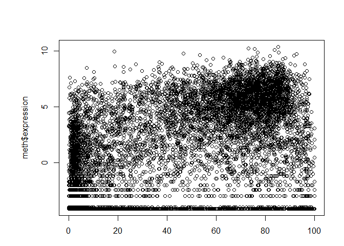
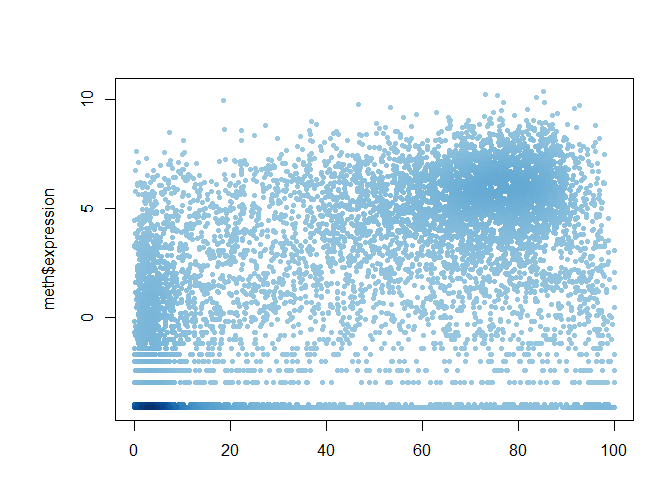
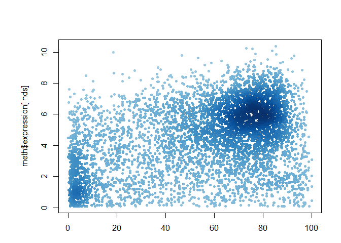

Class 5 Data visualization
================
Livia
2019-11-01

``` r
# Class 5 Data visualization
# set working directory
setwd("~/Documents/02-FA19-courses/BGGN-213 Bioinformatics/class05_plotting_EDA")
x <- rnorm(1000)

# How many things are in x
length(x)
```

    ## [1] 1000

``` r
mean(x)
```

    ## [1] 0.003132609

``` r
sd(x)
```

    ## [1] 0.9729042

``` r
summary(x)
```

    ##      Min.   1st Qu.    Median      Mean   3rd Qu.      Max. 
    ## -2.704339 -0.667324 -0.015705  0.003133  0.717941  2.597805

``` r
# make a box plot showing quartiles
boxplot(x)
```

<!-- -->

``` r
# make a histogram
hist(x,breaks=30) # too many
```

<!-- -->

``` r
hist(x,breaks=3) # too few
```

<!-- -->

``` r
hist(x) # default breaks 


# add a rug to the plot showing where the data actually is
rug(x)
```

<!-- -->

``` r
# read in the weight_chart file
weight <- read.table("bimm143_05_rstats/weight_chart.txt",header=TRUE)

# make a plot

plot(weight$Age,weight$Weight,type="o",pch=15,
     cex=1.5, lwd=2, ylim=c(2,10),
     xlab="Age (Months)",
     ylab="Weight (kg)",
     main="Baby weight with age",col="blue")
```

<!-- -->

``` r
# read in feature_counts.txt
mouse <- read.delim("bimm143_05_rstats/feature_counts.txt")

# this defines the margin size;
#         bot left   top  right
par(mar=c(3.1, 11.1, 4.1, 2))
barplot(mouse$Count, horiz=TRUE,ylab="",
        names.arg=mouse$Feature,las=1,main="Number of features in the mouse GRCm38 genome",
        xlim=c(0,80000))
```

<!-- -->

``` r
# fancy histogram
x <- c(rnorm(10000),rnorm(10000)+4)
par(mar=c(3.1, 6, 4.1, 2))
hist(x, breaks=80)
```

<!-- -->

``` r
# rainbow plot
mf <- read.delim("bimm143_05_rstats/male_female_counts.txt")
barplot(mf$Count,col=rainbow(10),horiz=TRUE,names.arg=mf$Sample,las=1)
```

<!-- -->

``` r
# blue vs red plot
barplot(mf$Count,col=c("red","blue"),horiz=TRUE,names.arg=mf$Sample,las=1)
```

<!-- -->

``` r
# color by value
genes <- read.delim("bimm143_05_rstats/up_down_expression.txt")
# inspect elements
table(genes$State)
```

    ## 
    ##       down unchanging         up 
    ##         72       4997        127

``` r
# plot condition 1 and 2
plot(genes$Condition1, genes$Condition2,col=genes$State)
```

<!-- -->

``` r
# check palette colors
palette()
```

    ## [1] "black"   "red"     "green3"  "blue"    "cyan"    "magenta" "yellow" 
    ## [8] "gray"

``` r
# change palette colors
palette(c("blue","grey","red"))
plot(genes$Condition1, genes$Condition2,col=genes$State)
```

<!-- -->

``` r
# Dynamic use of color
meth <- read.delim("bimm143_05_rstats/expression_methylation.txt")
plot(meth$gene.meth,meth$expression)
```

<!-- -->

``` r
# make a new color density vector
dcols <- densCols(meth$gene.meth,meth$expression)
plot(meth$gene.meth,meth$expression,col=dcols,pch=20)
```

<!-- -->

``` r
# only include data above 0
inds <- meth$expression > 0
dcols <- densCols(meth$gene.meth[inds],meth$expression[inds])

plot(meth$gene.meth[inds],meth$expression[inds],col=dcols,pch=20)
```

<!-- -->

``` r
# use custom colors for the density
dcols <- densCols(meth$gene.meth[inds],meth$expression[inds],
                  colramp = colorRampPalette(c("blue","green","red","yellow")))

plot(meth$gene.meth[inds],meth$expression[inds],col=dcols,pch=20)
```

<!-- -->
