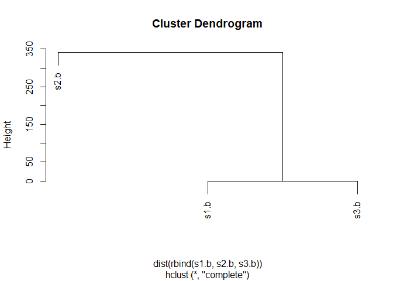

Lecture-6-Homework-Songster
================
Livia Songster
10/18/2019

# Lecture 6 Homework

## Original code that I optimized:

``` r
# Can you improve this analysis code?
library(bio3d)
s1 <- read.pdb("4AKE") # kinase with drug
```

    ##   Note: Accessing on-line PDB file

``` r
s2 <- read.pdb("1AKE") # kinase no drug
```

    ##   Note: Accessing on-line PDB file
    ##    PDB has ALT records, taking A only, rm.alt=TRUE

``` r
s3 <- read.pdb("1E4Y") # kinase with drug
```

    ##   Note: Accessing on-line PDB file

``` r
s1.chainA <- trim.pdb(s1, chain="A", elety="CA")
s2.chainA <- trim.pdb(s2, chain="A", elety="CA")
s3.chainA <- trim.pdb(s1, chain="A", elety="CA")

s1.b <- s1.chainA$atom$b
s2.b <- s2.chainA$atom$b
s3.b <- s3.chainA$atom$b

plotb3(s1.b, sse=s1.chainA, typ="l", ylab="Bfactor")
```

<!-- -->

``` r
plotb3(s2.b, sse=s2.chainA, typ="l", ylab="Bfactor")
```

<!-- -->

``` r
plotb3(s3.b, sse=s3.chainA, typ="l", ylab="Bfactor")
```

<!-- -->

# Here is my function for extracting b-factors from pdb files:

``` r
# this function will read in pdb files, 
AnalyzePDB <- function(pdb) { # pdb code/unique ID 
  
  require(bio3d) # first load bio3d package
  
  # Q1: read.pdb will read in a protein data bank (PDB) coordinate file as a list
  s <- read.pdb(pdb)
  
  # Q2: Subset the list to produce a smaller object, by chain (default A) or type of atom (elety)
  s.chainA <- trim.pdb(s,chain="A",elety="CA")
  
  # save b factors for each atom as a vector
  s.b <- s.chainA$atom$b
  
  # plot the b factors vs. residue number and print the plot
  # Q3: the arguments top and bot are defaulted to TRUE and draw rectangles for each SSE at the top/bottom of the plot
  plotb3(s.b, sse=s.chainA,type="l",ylab="Bfactor",main=paste(pdb))
  
  # this line will print into the console that the function has finished running.
  print(paste("B-factor analysis of",pdb, "PDB file is completed."))
  } # end function

AnalyzePDB("4AKE")
```

    ##   Note: Accessing on-line PDB file

    ## Warning in get.pdb(file, path = tempdir(), verbose = FALSE): C:
    ## \Users\Livia\AppData\Local\Temp\RtmpGAILlu/4AKE.pdb exists. Skipping
    ## download

<!-- -->

    ## [1] "B-factor analysis of 4AKE PDB file is completed."

### Q4: It would be useful to see how similar or dissimilar different b-factors are from each other. This could be done by superimposing all the graphs on top of each other. Or, we could use the hclust function:

``` r
hc <- hclust( dist( rbind(s1.b, s2.b, s3.b) ) )
plot(hc)
```

<!-- -->
\#\#\# Q5: This shows that the first and third pdb files are the most
similar to each
other.

# Q6: See my function above\! Conversely, we can make this function capable of analyzing multiple pdb files in a row:

``` r
AnalyzePDB.multi <- function(vector) {
  for (x in vector) {
    AnalyzePDB(x)
  }
}

codes <- c("4AKE","1AKE","1E4Y")
AnalyzePDB.multi(codes)
```

    ##   Note: Accessing on-line PDB file

    ## Warning in get.pdb(file, path = tempdir(), verbose = FALSE): C:
    ## \Users\Livia\AppData\Local\Temp\RtmpGAILlu/4AKE.pdb exists. Skipping
    ## download

    ## [1] "B-factor analysis of 4AKE PDB file is completed."
    ##   Note: Accessing on-line PDB file

    ## Warning in get.pdb(file, path = tempdir(), verbose = FALSE): C:
    ## \Users\Livia\AppData\Local\Temp\RtmpGAILlu/1AKE.pdb exists. Skipping
    ## download

<!-- -->

    ##    PDB has ALT records, taking A only, rm.alt=TRUE

    ## [1] "B-factor analysis of 1AKE PDB file is completed."
    ##   Note: Accessing on-line PDB file

    ## Warning in get.pdb(file, path = tempdir(), verbose = FALSE): C:
    ## \Users\Livia\AppData\Local\Temp\RtmpGAILlu/1E4Y.pdb exists. Skipping
    ## download

<!-- --><!-- -->

    ## [1] "B-factor analysis of 1E4Y PDB file is completed."

``` r
# or we could use sapply:
sapply(codes,AnalyzePDB)
```

    ##   Note: Accessing on-line PDB file

    ## Warning in get.pdb(file, path = tempdir(), verbose = FALSE): C:
    ## \Users\Livia\AppData\Local\Temp\RtmpGAILlu/4AKE.pdb exists. Skipping
    ## download

    ## [1] "B-factor analysis of 4AKE PDB file is completed."
    ##   Note: Accessing on-line PDB file

    ## Warning in get.pdb(file, path = tempdir(), verbose = FALSE): C:
    ## \Users\Livia\AppData\Local\Temp\RtmpGAILlu/1AKE.pdb exists. Skipping
    ## download

<!-- -->

    ##    PDB has ALT records, taking A only, rm.alt=TRUE

    ## [1] "B-factor analysis of 1AKE PDB file is completed."
    ##   Note: Accessing on-line PDB file

    ## Warning in get.pdb(file, path = tempdir(), verbose = FALSE): C:
    ## \Users\Livia\AppData\Local\Temp\RtmpGAILlu/1E4Y.pdb exists. Skipping
    ## download

<!-- --><!-- -->

    ## [1] "B-factor analysis of 1E4Y PDB file is completed."

    ##                                               4AKE 
    ## "B-factor analysis of 4AKE PDB file is completed." 
    ##                                               1AKE 
    ## "B-factor analysis of 1AKE PDB file is completed." 
    ##                                               1E4Y 
    ## "B-factor analysis of 1E4Y PDB file is completed."
