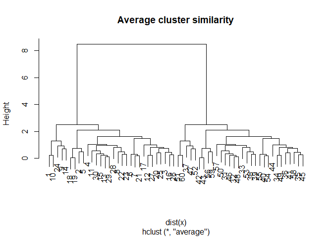
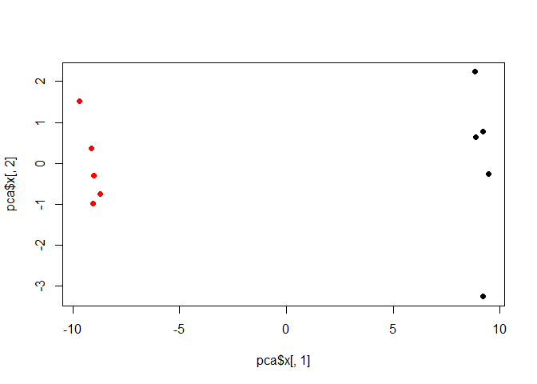

Class08 - Machine Learning 1
================
Livia Songster
10/25/2019

## K-means example

We will make up some data to cluster.

``` r
tmp <- c(rnorm(30,-3), rnorm(30,3))
x <- cbind(x=tmp, y=rev(tmp))

plot(x)
```

<!-- -->

Use the kmeans() function setting k to 2 and nstart=20. Inspect/print
the results.

``` r
k <- kmeans(x,centers=2,nstart=20)
k
```

    ## K-means clustering with 2 clusters of sizes 30, 30
    ## 
    ## Cluster means:
    ##           x         y
    ## 1  3.109615 -2.812574
    ## 2 -2.812574  3.109615
    ## 
    ## Clustering vector:
    ##  [1] 2 2 2 2 2 2 2 2 2 2 2 2 2 2 2 2 2 2 2 2 2 2 2 2 2 2 2 2 2 2 1 1 1 1 1
    ## [36] 1 1 1 1 1 1 1 1 1 1 1 1 1 1 1 1 1 1 1 1 1 1 1 1 1
    ## 
    ## Within cluster sum of squares by cluster:
    ## [1] 57.34191 57.34191
    ##  (between_SS / total_SS =  90.2 %)
    ## 
    ## Available components:
    ## 
    ## [1] "cluster"      "centers"      "totss"        "withinss"    
    ## [5] "tot.withinss" "betweenss"    "size"         "iter"        
    ## [9] "ifault"

Q. How many points are in each cluster? *both are 30.*

Q. What ‘component’ of your result object details - cluster size? *Shown
in component 7 “size”*

  - cluster assignment/membership? *Shown in component 1 “cluster”*

  - cluster center? *shown in component 2 “centers”*

<!-- end list -->

``` r
# for size
k$size
```

    ## [1] 30 30

``` r
# for centers
k$centers
```

    ##           x         y
    ## 1  3.109615 -2.812574
    ## 2 -2.812574  3.109615

Plot x colored by the kmeans cluster assignment and add cluster centers
as blue points

``` r
plot(x,col=k$cluster)
# this will add the cluster centers as blue points
points(k$center,col="blue",pch=15)
```

<!-- -->

## Hierarchical clustering

``` r
# First we need to calculate point (dis)similarity as the Euclidean distance between observations
dist_matrix <- dist(x)

# The hclust() function returns a hierarchical clustering model
hc <- hclust(d = dist_matrix)

# the print method is not so useful here
hc
```

    ## 
    ## Call:
    ## hclust(d = dist_matrix)
    ## 
    ## Cluster method   : complete 
    ## Distance         : euclidean 
    ## Number of objects: 60

``` r
# Our input is a distance matrix from the dist() function. Lets make sure we understand it first
dist_matrix <- dist(x)
dim(dist_matrix)
```

    ## NULL

``` r
# view the matrix
# View( as.matrix(dist_matrix) )

# check dimensions of x
dim(x)
```

    ## [1] 60  2

``` r
# check dimenstions of our distance matrix
dim(as.matrix(dist_matrix))
```

    ## [1] 60 60

``` r
# Create hierarchical cluster model: hc
hc <- hclust(dist(x))

# We can plot the results as a dendrogram
plot(hc)

# Add a red line at height 6
abline(h=6, col="red")
```

<!-- -->

``` r
# Cut by height h=6; prints which clusters each point will lie in
cutree(hc, h=6) 
```

    ##  [1] 1 1 1 1 1 1 1 1 1 1 1 1 1 1 1 1 1 1 1 1 1 1 1 1 1 1 1 1 1 1 2 2 2 2 2
    ## [36] 2 2 2 2 2 2 2 2 2 2 2 2 2 2 2 2 2 2 2 2 2 2 2 2 2

``` r
# Cut into two groups; prints which clusters each point will lie in
cutree(hc, k=2) 
```

    ##  [1] 1 1 1 1 1 1 1 1 1 1 1 1 1 1 1 1 1 1 1 1 1 1 1 1 1 1 1 1 1 1 2 2 2 2 2
    ## [36] 2 2 2 2 2 2 2 2 2 2 2 2 2 2 2 2 2 2 2 2 2 2 2 2 2

## Linking clusters in hierarchical clustering

How is distance between clusters determined?

There are four main methods to determine which cluster should be linked:

➡ *Complete*: pairwise similarity between all observations in cluster 1
and cluster 2, and uses largest of similarities

``` r
hc.complete <- hclust(dist(x),method="complete")
plot(hc.complete,main="Complete cluster similarity")
```

<!-- -->

➡ *Single*: same as above but uses smallest of similarities

``` r
hc.single <- hclust(dist(x),method="single")
plot(hc.single,main="Single cluster similarity")
```

<!-- -->

➡ *Average*: same as above but uses average of similarities

``` r
hc.average <- hclust(dist(x),method="average")
plot(hc.average,main="Average cluster similarity")
```

<!-- -->

➡ *Centroid*: finds centroid of cluster 1 and centroid of cluster 2, and
uses similarity between two centroids

``` r
hc.centroid <- hclust(dist(x),method="centroid")
plot(hc.centroid,main="Centroid cluster similarity")
```

<!-- -->

## More examples and practice

### Step 1. Generate some example data for clustering

``` r
x <- rbind(
 matrix(rnorm(100, mean=0, sd = 0.3), ncol = 2), # c1
 matrix(rnorm(100, mean = 1, sd = 0.3), ncol = 2), # c2
 matrix(c(rnorm(50, mean = 1, sd = 0.3), rnorm(50, mean = 0, sd = 0.3)), ncol = 2)) # c3
colnames(x) <- c("x", "y")
head(x)
```

    ##                x          y
    ## [1,]  0.48177477 -0.1673183
    ## [2,]  0.09405048 -0.1257573
    ## [3,] -0.23152334 -0.1893206
    ## [4,] -0.24095315 -0.0364716
    ## [5,] -0.26803541 -0.2047505
    ## [6,] -0.04050321  1.0019741

### Step 2. Plot the data without clustering

``` r
plot(x)
```

<!-- -->

### Step 3. Generate colors for known clusters (just so we can compare to hclust results)

``` r
col <- as.factor( rep(c("c1","c2","c3"), each=50) )

plot(x, col=col,main="Known clusters")
```

<!-- -->

### Your Turn\!

Q. Use the dist(), hclust(), plot() and cutree() functions to return 2
and 3 clusters

``` r
hc <- hclust(d = dist(x))
plot(hc,main="Hierarchical cluster dendrogram")
```

<!-- -->

``` r
# 2 clusters
clust2 <- cutree(hc,k=2)
plot(x,col=clust2,main="2 Hierarchical clusters")
```

<!-- -->

``` r
# 3 clusters
clust3 <- cutree(hc,k=3)
plot(x,col=clust3,main="3 Hierarchical clusters")
```

<!-- -->

``` r
# See how many points went into each cluster
table(col,clust3)
```

    ##     clust3
    ## col   1  2  3
    ##   c1  2 43  5
    ##   c2  0  0 50
    ##   c3 35  0 15

Q. How does this compare to your known ‘col’ groups?

``` r
# also do kmeans quick
k2 <- kmeans(x,centers=2,nstart=20)
k3 <- kmeans(x,centers=3,nstart=20)


# put plots into quadrant
par(mfrow=c(2,3))
plot(x, col=col,main="Known clusters")
plot(hc,main="Hierarchical cluster dendrogram")
plot(x,col=clust2,main="2 Hierarchical clusters")
plot(x,col=clust3,main="3 Hierarchical clusters")
plot(x,col=k2$cluster,main="K-means k = 2")
points(k2$center,col="blue",pch=15)

plot(x,col=k3$cluster,main="K-means k = 3")
points(k3$center,col="blue",pch=15)
```

<!-- -->

# Introduction to PCA plots

``` r
mydata <- read.csv("expression.csv",row.names = 1)
head(mydata) 
```

    ##        wt1 wt2  wt3  wt4 wt5 ko1 ko2 ko3 ko4 ko5
    ## gene1  439 458  408  429 420  90  88  86  90  93
    ## gene2  219 200  204  210 187 427 423 434 433 426
    ## gene3 1006 989 1030 1017 973 252 237 238 226 210
    ## gene4  783 792  829  856 760 849 856 835 885 894
    ## gene5  181 249  204  244 225 277 305 272 270 279
    ## gene6  460 502  491  491 493 612 594 577 618 638

The samples are columns, and the genes are rows\! Now we have our data,
we call prcomp() to do PCA.

NOTE: prcomp() expects the samples to be rows and genes to be columns so
we need to first transpose the matrix with the t() function.

``` r
# first transpose the data 
pca <- prcomp(t(mydata), scale=TRUE)

## See what is returned by the prcomp() function
attributes(pca) 
```

    ## $names
    ## [1] "sdev"     "rotation" "center"   "scale"    "x"       
    ## 
    ## $class
    ## [1] "prcomp"

The output for x contains the principal components (PCs) for drawing our
first graph. Here we will take the first two columns in pca$x
(corresponding to PC1 and PC2) to draw a 2-D plot.

``` r
## A basic PC1 vs PC2 2-D plot
plot(pca$x[,1], pca$x[,2]) 
```

<!-- -->

``` r
summary(pca)
```

    ## Importance of components:
    ##                           PC1    PC2     PC3     PC4     PC5     PC6
    ## Standard deviation     9.6237 1.5198 1.05787 1.05203 0.88062 0.82545
    ## Proportion of Variance 0.9262 0.0231 0.01119 0.01107 0.00775 0.00681
    ## Cumulative Proportion  0.9262 0.9493 0.96045 0.97152 0.97928 0.98609
    ##                            PC7     PC8     PC9      PC10
    ## Standard deviation     0.80111 0.62065 0.60342 3.348e-15
    ## Proportion of Variance 0.00642 0.00385 0.00364 0.000e+00
    ## Cumulative Proportion  0.99251 0.99636 1.00000 1.000e+00

Looks interesting with a nice separation of samples into two groups of 5
samples each. Now we can use the square of pca$sdev, which stands for
“standard deviation”, to calculate how much variation in the original
data each PC accounts for.

``` r
## Variance captured per PC
pca.var <- pca$sdev^2

## Percent variance is often more informative to look at
pca.var.per <- round(pca.var/sum(pca.var)*100, 1)

pca.var.per
```

    ##  [1] 92.6  2.3  1.1  1.1  0.8  0.7  0.6  0.4  0.4  0.0

``` r
# next let's make a scree plot
barplot(pca.var.per, main="Scree Plot",
 xlab="Principal Component", ylab="Percent Variation")
```

<!-- -->

``` r
## A vector of colors for wt and ko samples
colvec <- colnames(mydata)
colvec[grep("wt", colvec)] <- "red"
colvec[grep("ko", colvec)] <- "blue"

plot(pca$x[,1], pca$x[,2], col=colvec, pch=16,
 xlab=paste0("PC1 (", pca.var.per[1], "%)"),
 ylab=paste0("PC2 (", pca.var.per[2], "%)"))

text(pca$x[,1], pca$x[,2], labels = colnames(mydata), pos=c(rep(4,5), rep(2,5)))
```

<!-- -->

``` r
## IN THE CONSOLE! Click to identify which sample is which
## identify(pca$x[,1], pca$x[,2], labels=colnames(mydata))
## Press ESC to exit… 


## Another way to color by sample type
## Extract the first 2 characters of the sample name
sample.type <- substr(colnames(mydata),1,2)
sample.type
```

    ##  [1] "wt" "wt" "wt" "wt" "wt" "ko" "ko" "ko" "ko" "ko"

``` r
## now use this as a factor input to color our plot
plot(pca$x[,1], pca$x[,2], col=as.factor(sample.type), pch=16)
```

<!-- -->

Find the top 10 measurements (genes) that contribute most to pc1 in
either direction (+ or -)

``` r
loading_scores <- pca$rotation[,1]

## Find the top 10 measurements (genes) that contribute
## most to PC1 in either direction (+ or -)
gene_scores <- abs(loading_scores) 
gene_score_ranked <- sort(gene_scores, decreasing=TRUE)

## show the names of the top 10 genes
top_10_genes <- names(gene_score_ranked[1:10])
top_10_genes
```

    ##  [1] "gene100" "gene66"  "gene45"  "gene68"  "gene98"  "gene60"  "gene21" 
    ##  [8] "gene56"  "gene10"  "gene90"

``` r
## plot the loading scores
barplot(pca$rotation[,1], las=2 )
```

<!-- -->

# Next let’s analyze some food data from the UK

``` r
x <- read.csv("UK_foods.csv",row.names = 1)

# check dimentions
dim(x)
```

    ## [1] 17  4

``` r
head(x,6)
```

    ##                England Wales Scotland N.Ireland
    ## Cheese             105   103      103        66
    ## Carcass_meat       245   227      242       267
    ## Other_meat         685   803      750       586
    ## Fish               147   160      122        93
    ## Fats_and_oils      193   235      184       209
    ## Sugars             156   175      147       139

``` r
# next generate a bar plot to visualize the data... not very useful
par(mfrow=c(1,2))
barplot(as.matrix(x), beside=T, col=rainbow(nrow(x)),main="barplot",las=2)
# vertical stacked plot
barplot(as.matrix(x), beside=F, col=rainbow(nrow(x)),main="stacked barplot",las=2) # las=2 will make sideways x axis labels
```

<!-- -->

Next let’s try to make all pairwise plots.

``` r
pairs(x, col=rainbow(10), pch=16)
```

<!-- --> Now for
some PCA to make this actually interpretable:

``` r
# Use the prcomp() PCA function 
pca <- prcomp(t(x)) # transpose the data
summary(pca)
```

    ## Importance of components:
    ##                             PC1      PC2      PC3       PC4
    ## Standard deviation     324.1502 212.7478 73.87622 4.189e-14
    ## Proportion of Variance   0.6744   0.2905  0.03503 0.000e+00
    ## Cumulative Proportion    0.6744   0.9650  1.00000 1.000e+00

``` r
# scree plot
plot(pca,main="scree plot")
```

<!-- -->

``` r
# Plot PC1 vs PC2
plot(pca$x[,1], pca$x[,2], xlab="PC1", ylab="PC2", xlim=c(-270,500))

text(pca$x[,1], pca$x[,2], colnames(x)) # this code adds the data name on top of the point (in light gray)
```

<!-- -->

``` r
# next add color to the plot so the colors of the country names match the colors in the map and table

plot(pca$x[,1], pca$x[,2], xlab="PC1", ylab="PC2", xlim=c(-270,500),col=c("orange","pink","blue","green"))
text(pca$x[,1], pca$x[,2], colnames(x),col=c("orange","pink","blue","green"))
```

<!-- -->

Calculate the variance in the original data that each PC accounts for.

``` r
# all data
v <- round( pca$sdev^2/sum(pca$sdev^2) * 100 )
v
```

    ## [1] 67 29  4  0

``` r
## or the second row here...
z <- summary(pca)
z$importance
```

    ##                              PC1       PC2      PC3          PC4
    ## Standard deviation     324.15019 212.74780 73.87622 4.188568e-14
    ## Proportion of Variance   0.67444   0.29052  0.03503 0.000000e+00
    ## Cumulative Proportion    0.67444   0.96497  1.00000 1.000000e+00

``` r
# plot the % variances
barplot(v, xlab="Principal Component", ylab="Percent Variation")
```

<!-- -->

## Next let’s look at the loading scores (original variables of the PCs) from the rotation component of prcomp().

``` r
## Lets focus on PC1 as it accounts for > 90% of variance 
par(mar=c(10, 3, 1, 0)) # change the margins
head(pca$rotation)
```

    ##                         PC1         PC2         PC3         PC4
    ## Cheese         -0.056955380 -0.01601285 -0.02394295 -0.69171804
    ## Carcass_meat    0.047927628 -0.01391582 -0.06367111  0.63538491
    ## Other_meat     -0.258916658  0.01533114  0.55384854  0.19817592
    ## Fish           -0.084414983  0.05075495 -0.03906481 -0.01582463
    ## Fats_and_oils  -0.005193623  0.09538866  0.12522257  0.05234744
    ## Sugars         -0.037620983  0.04302170  0.03605745  0.01448135

``` r
barplot( pca$rotation[,1], las=2,main="PC1 loading scores")
```

<!-- -->

``` r
## and now PC2
barplot( pca$rotation[,2], las=2,main="PC2 loading scores")
```

<!-- -->

# This can be summarized in a biplot.

``` r
## The builtin biplot() can be useful for small datasets 
biplot(pca,main="BiPlot")
```

<!-- -->
