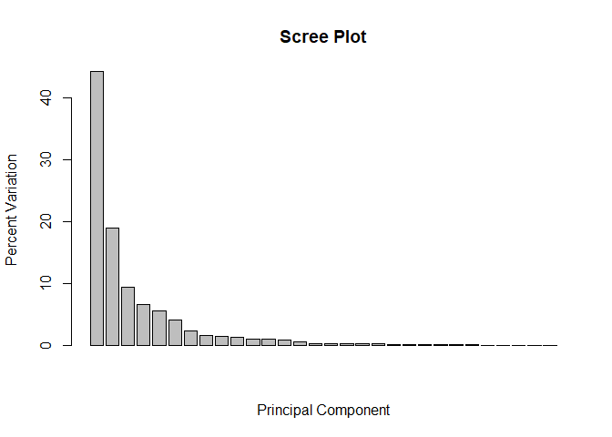
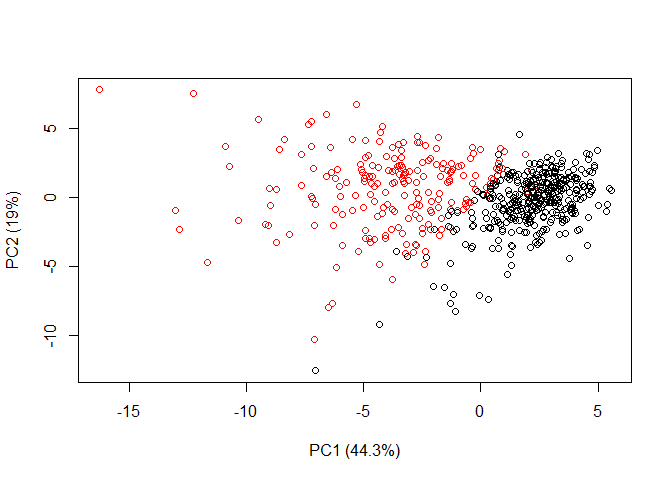
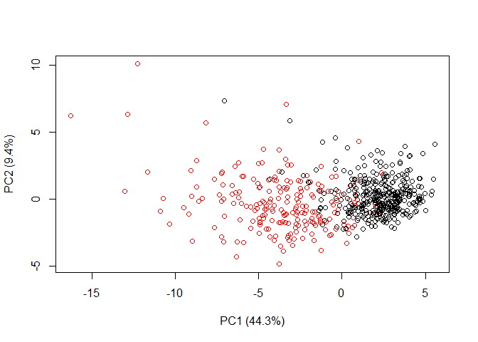
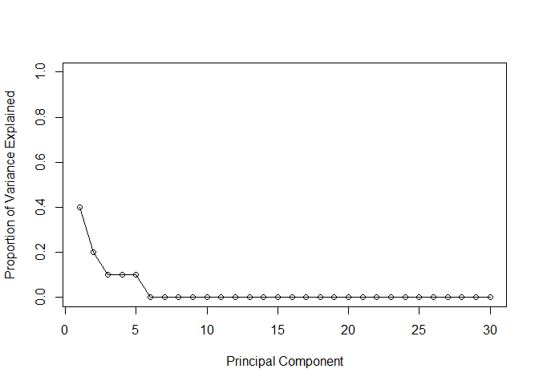
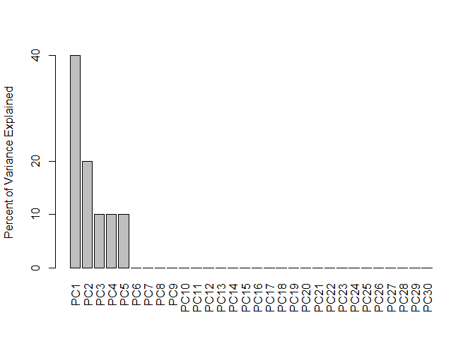
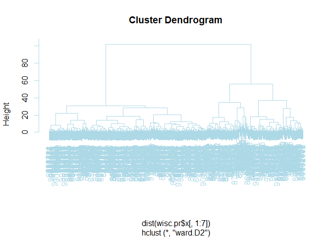
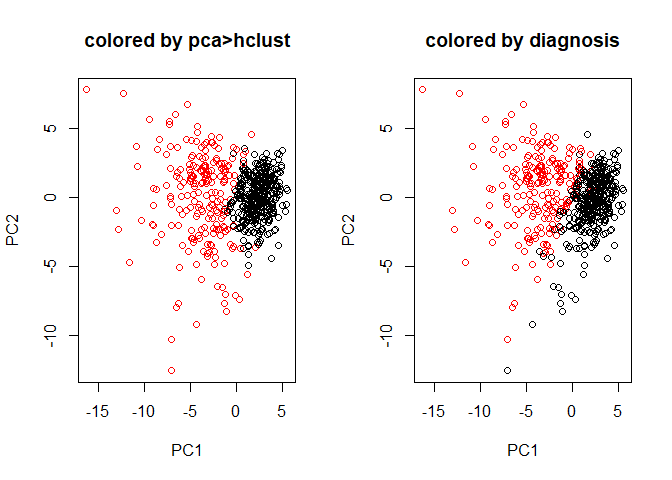

Class 9 - Unsupervised Learning Mini-Project
================
Livia Songster
10/30/2019

# Load in data

``` r
# Save your input data file to a new 'data' directory
fna.data <- "data/WisconsinCancer.csv"

# Complete the following code to input the data and store as wisc.df
wisc.df <- read.csv("WisconsinCancer.csv")
```

Next we can examine the data from patient samples.

``` r
# number of observations/patients
nrow(wisc.df)
```

    ## [1] 569

``` r
# number of malignant cases, denoted M
table(wisc.df$diagnosis)
```

    ## 
    ##   B   M 
    ## 357 212

``` r
# number of features/columns ending in _mean
colnames(wisc.df)
```

    ##  [1] "id"                      "diagnosis"              
    ##  [3] "radius_mean"             "texture_mean"           
    ##  [5] "perimeter_mean"          "area_mean"              
    ##  [7] "smoothness_mean"         "compactness_mean"       
    ##  [9] "concavity_mean"          "concave.points_mean"    
    ## [11] "symmetry_mean"           "fractal_dimension_mean" 
    ## [13] "radius_se"               "texture_se"             
    ## [15] "perimeter_se"            "area_se"                
    ## [17] "smoothness_se"           "compactness_se"         
    ## [19] "concavity_se"            "concave.points_se"      
    ## [21] "symmetry_se"             "fractal_dimension_se"   
    ## [23] "radius_worst"            "texture_worst"          
    ## [25] "perimeter_worst"         "area_worst"             
    ## [27] "smoothness_worst"        "compactness_worst"      
    ## [29] "concavity_worst"         "concave.points_worst"   
    ## [31] "symmetry_worst"          "fractal_dimension_worst"
    ## [33] "X"

``` r
length(grep("_mean",colnames(wisc.df)))
```

    ## [1] 10

``` r
# make sure that the data was loaded correctly
#head(wisc.df,5)
```

Next we store the data as a matrix so we can manipulate the numeric
data

``` r
# exclude first two columns, id and diagnosis, and the last column which has NAs
wisc.data <- as.matrix(wisc.df[,3:32])

# Set the row names of wisc.data
row.names(wisc.data) <- wisc.df$id
#head(wisc.data)

# Create diagnosis vector for later 
diagnosis <- wisc.df$diagnosis
```

# Next: perform PCA

``` r
# Check column means and standard deviations
colMeans(wisc.data)
```

    ##             radius_mean            texture_mean          perimeter_mean 
    ##            1.412729e+01            1.928965e+01            9.196903e+01 
    ##               area_mean         smoothness_mean        compactness_mean 
    ##            6.548891e+02            9.636028e-02            1.043410e-01 
    ##          concavity_mean     concave.points_mean           symmetry_mean 
    ##            8.879932e-02            4.891915e-02            1.811619e-01 
    ##  fractal_dimension_mean               radius_se              texture_se 
    ##            6.279761e-02            4.051721e-01            1.216853e+00 
    ##            perimeter_se                 area_se           smoothness_se 
    ##            2.866059e+00            4.033708e+01            7.040979e-03 
    ##          compactness_se            concavity_se       concave.points_se 
    ##            2.547814e-02            3.189372e-02            1.179614e-02 
    ##             symmetry_se    fractal_dimension_se            radius_worst 
    ##            2.054230e-02            3.794904e-03            1.626919e+01 
    ##           texture_worst         perimeter_worst              area_worst 
    ##            2.567722e+01            1.072612e+02            8.805831e+02 
    ##        smoothness_worst       compactness_worst         concavity_worst 
    ##            1.323686e-01            2.542650e-01            2.721885e-01 
    ##    concave.points_worst          symmetry_worst fractal_dimension_worst 
    ##            1.146062e-01            2.900756e-01            8.394582e-02

``` r
apply(wisc.data,2,sd)
```

    ##             radius_mean            texture_mean          perimeter_mean 
    ##            3.524049e+00            4.301036e+00            2.429898e+01 
    ##               area_mean         smoothness_mean        compactness_mean 
    ##            3.519141e+02            1.406413e-02            5.281276e-02 
    ##          concavity_mean     concave.points_mean           symmetry_mean 
    ##            7.971981e-02            3.880284e-02            2.741428e-02 
    ##  fractal_dimension_mean               radius_se              texture_se 
    ##            7.060363e-03            2.773127e-01            5.516484e-01 
    ##            perimeter_se                 area_se           smoothness_se 
    ##            2.021855e+00            4.549101e+01            3.002518e-03 
    ##          compactness_se            concavity_se       concave.points_se 
    ##            1.790818e-02            3.018606e-02            6.170285e-03 
    ##             symmetry_se    fractal_dimension_se            radius_worst 
    ##            8.266372e-03            2.646071e-03            4.833242e+00 
    ##           texture_worst         perimeter_worst              area_worst 
    ##            6.146258e+00            3.360254e+01            5.693570e+02 
    ##        smoothness_worst       compactness_worst         concavity_worst 
    ##            2.283243e-02            1.573365e-01            2.086243e-01 
    ##    concave.points_worst          symmetry_worst fractal_dimension_worst 
    ##            6.573234e-02            6.186747e-02            1.806127e-02

This data needs to be scaled, because the means and SDs are not uniform.

``` r
# Perform PCA on wisc.data by completing the following code
wisc.pr <- prcomp(wisc.data, scale= TRUE)

# check summary of data
summary(wisc.pr)
```

    ## Importance of components:
    ##                           PC1    PC2     PC3     PC4     PC5     PC6
    ## Standard deviation     3.6444 2.3857 1.67867 1.40735 1.28403 1.09880
    ## Proportion of Variance 0.4427 0.1897 0.09393 0.06602 0.05496 0.04025
    ## Cumulative Proportion  0.4427 0.6324 0.72636 0.79239 0.84734 0.88759
    ##                            PC7     PC8    PC9    PC10   PC11    PC12
    ## Standard deviation     0.82172 0.69037 0.6457 0.59219 0.5421 0.51104
    ## Proportion of Variance 0.02251 0.01589 0.0139 0.01169 0.0098 0.00871
    ## Cumulative Proportion  0.91010 0.92598 0.9399 0.95157 0.9614 0.97007
    ##                           PC13    PC14    PC15    PC16    PC17    PC18
    ## Standard deviation     0.49128 0.39624 0.30681 0.28260 0.24372 0.22939
    ## Proportion of Variance 0.00805 0.00523 0.00314 0.00266 0.00198 0.00175
    ## Cumulative Proportion  0.97812 0.98335 0.98649 0.98915 0.99113 0.99288
    ##                           PC19    PC20   PC21    PC22    PC23   PC24
    ## Standard deviation     0.22244 0.17652 0.1731 0.16565 0.15602 0.1344
    ## Proportion of Variance 0.00165 0.00104 0.0010 0.00091 0.00081 0.0006
    ## Cumulative Proportion  0.99453 0.99557 0.9966 0.99749 0.99830 0.9989
    ##                           PC25    PC26    PC27    PC28    PC29    PC30
    ## Standard deviation     0.12442 0.09043 0.08307 0.03987 0.02736 0.01153
    ## Proportion of Variance 0.00052 0.00027 0.00023 0.00005 0.00002 0.00000
    ## Cumulative Proportion  0.99942 0.99969 0.99992 0.99997 1.00000 1.00000

From your results, 44.27% of the original variance is captured by the
first principal components (PC1).

Three principal components (PCs) are required to describe at least 70%
of the original variance in the data, and 7 PCs are required to describe
at least 90% of the original variance.

# Interpreting PCA results

Via plots.

``` r
biplot(wisc.pr)
```

<!-- -->

This plot is very poor, so let’s make our own.

``` r
## Variance captured per PC
pca.var <- wisc.pr$sdev^2

## Percent variance is often more informative to look at
pca.var.per <- round(pca.var/sum(pca.var)*100, 1)

pca.var.per
```

    ##  [1] 44.3 19.0  9.4  6.6  5.5  4.0  2.3  1.6  1.4  1.2  1.0  0.9  0.8  0.5
    ## [15]  0.3  0.3  0.2  0.2  0.2  0.1  0.1  0.1  0.1  0.1  0.1  0.0  0.0  0.0
    ## [29]  0.0  0.0

``` r
# next let's make a scree plot
barplot(pca.var.per, main="Scree Plot",
 xlab="Principal Component", ylab="Percent Variation")
```

<!-- -->

``` r
# Scatter plot observations by components 1 and 2
plot(wisc.pr$x[,1], wisc.pr$x[,2], col = diagnosis,
 xlab=paste0("PC1 (", pca.var.per[1], "%)"),
 ylab=paste0("PC2 (", pca.var.per[2], "%)"))
```

<!-- -->

``` r
# Repeat for components 1 and 3
plot(wisc.pr$x[,1], wisc.pr$x[,3], col = diagnosis,
 xlab=paste0("PC1 (", pca.var.per[1], "%)"),
 ylab=paste0("PC2 (", pca.var.per[3], "%)"))
```

<!-- -->

# Variance explained

I did a bit of this above, but here it is again in more detail:

``` r
## Variance captured per PC
pca.var <- wisc.pr$sdev^2

head(pca.var)
```

    ## [1] 13.281608  5.691355  2.817949  1.980640  1.648731  1.207357

``` r
## Fraction of variance is often more informative to look at
# Variance explained by each principal component: pve
pve <- round(pca.var/sum(pca.var), 1)

head(pve)
```

    ## [1] 0.4 0.2 0.1 0.1 0.1 0.0

``` r
# A few different scree plots:

# Plot variance explained for each principal component
plot(pve, xlab = "Principal Component", 
     ylab = "Proportion of Variance Explained", 
     ylim = c(0, 1), type = "o")
```

<!-- -->

``` r
# Alternative scree plot of the same data, note data driven y-axis
barplot(pve, ylab = "Percent of Variance Explained",
     names.arg=paste0("PC",1:length(pve)), las=2, axes = FALSE)+
axis(2, at=pve, labels=round(pve,2)*100 )
```

<!-- -->

    ##       [,1]
    ##  [1,]  0.7
    ##  [2,]  1.9
    ##  [3,]  3.1
    ##  [4,]  4.3
    ##  [5,]  5.5
    ##  [6,]  6.7
    ##  [7,]  7.9
    ##  [8,]  9.1
    ##  [9,] 10.3
    ## [10,] 11.5
    ## [11,] 12.7
    ## [12,] 13.9
    ## [13,] 15.1
    ## [14,] 16.3
    ## [15,] 17.5
    ## [16,] 18.7
    ## [17,] 19.9
    ## [18,] 21.1
    ## [19,] 22.3
    ## [20,] 23.5
    ## [21,] 24.7
    ## [22,] 25.9
    ## [23,] 27.1
    ## [24,] 28.3
    ## [25,] 29.5
    ## [26,] 30.8
    ## [27,] 32.0
    ## [28,] 33.2
    ## [29,] 34.5
    ## [30,] 35.9

Next let’s try another CRAN package for generating PCA plots:

``` r
## ggplot based graph
#install.packages("factoextra")
library(factoextra)
```

    ## Loading required package: ggplot2

    ## Welcome! Related Books: `Practical Guide To Cluster Analysis in R` at https://goo.gl/13EFCZ

``` r
fviz_eig(wisc.pr, addlabels = TRUE)
```

<!-- -->

Understanding check:

Q13: For the first principal component, and using two significant
figures , what is the component of the loading vector
(i.e. wisc.pr$rotation\[,1\]) for the feature radius\_mean?

``` r
wisc.pr$rotation["radius_mean",1]
```

    ## [1] -0.2189024

Q14. For the first principal component, and using two significant
figures, what is the component of the loading vector
(i.e. wisc.pr$rotation\[,1\]) for the feature smoothness\_se?

``` r
wisc.pr$rotation["smoothness_se",1]
```

    ## [1] -0.01453145

Q15. Which original variable contributes most to
    PC1?

``` r
sort(abs(wisc.pr$rotation[,1]),decreasing=TRUE)
```

    ##     concave.points_mean          concavity_mean    concave.points_worst 
    ##              0.26085376              0.25840048              0.25088597 
    ##        compactness_mean         perimeter_worst         concavity_worst 
    ##              0.23928535              0.23663968              0.22876753 
    ##            radius_worst          perimeter_mean              area_worst 
    ##              0.22799663              0.22753729              0.22487053 
    ##               area_mean             radius_mean            perimeter_se 
    ##              0.22099499              0.21890244              0.21132592 
    ##       compactness_worst               radius_se                 area_se 
    ##              0.21009588              0.20597878              0.20286964 
    ##       concave.points_se          compactness_se            concavity_se 
    ##              0.18341740              0.17039345              0.15358979 
    ##         smoothness_mean           symmetry_mean fractal_dimension_worst 
    ##              0.14258969              0.13816696              0.13178394 
    ##        smoothness_worst          symmetry_worst           texture_worst 
    ##              0.12795256              0.12290456              0.10446933 
    ##            texture_mean    fractal_dimension_se  fractal_dimension_mean 
    ##              0.10372458              0.10256832              0.06436335 
    ##             symmetry_se              texture_se           smoothness_se 
    ##              0.04249842              0.01742803              0.01453145

# Hierarchical clustering

As part of the preparation for hierarchical clustering, the distance
between all pairs of observations are computed. Furthermore, there are
different ways to link clusters together, with single, complete, and
average being the most common linkage methods.

``` r
# Scale the wisc.data data: data.scaled
data.scaled <- scale(wisc.data)

# Calculate the (Euclidean) distances between all pairs of observations in the new scaled dataset
data.dist <- dist(data.scaled)

# Create a hierarchical clustering model using complete linkage
wisc.hclust <- hclust(data.dist, method="complete")
```

# Results of hierarchical clustering

``` r
# make a dendrogram
plot(wisc.hclust)+
abline(h=19, col="red", lty=2)
```

<!-- -->

    ## integer(0)

# Selecting number of clusters

When performing supervised learning - that is, when you’re trying to
predict some target variable of interest and that target variable is
available in the original data - using clustering to create new features
may or may not improve the performance of the final model.

This exercise will help you determine if, in this case, hierarchical
clustering provides a promising new feature.

``` r
# Use cutree() to cut the tree so that it has 4 clusters
wisc.hclust.clusters <- cutree(wisc.hclust,k=4)

# check this compared to the diagnosis we saved before
hc.clust.vs.diag <- table(wisc.hclust.clusters,diagnosis)
hc.clust.vs.diag
```

    ##                     diagnosis
    ## wisc.hclust.clusters   B   M
    ##                    1  12 165
    ##                    2   2   5
    ##                    3 343  40
    ##                    4   0   2

We can think in terms of TRUE positive, TRUE negative, FALSE positive
and FALSE negative as we discussed back in an earlier class. Also recall
that we discussed the concepts of sensitivity, specificity and ROC/AUC
analysis.

Sensitivity refers to a test’s ability to correctly detect ill patients
who do have the condition. In our example here the sensitivity is the
total number of samples in the cluster identified as predominantly
malignant (cancerous) divided by the total number of known malignant
samples.

Specificity relates to a test’s ability to correctly reject healthy
patients without a condition. In our example specificity is the
proportion of benign (not cancerous) samples in the cluster identified
as predominantly benign that are known to be benign.

``` r
# Calculate sensitivity
hc.M <- hc.clust.vs.diag[1, 2] # M for malignant
TM <- sum(hc.clust.vs.diag[,2]) # TM for total malignant
        
hc.sensitivity <- hc.M / TM

hc.sensitivity
```

    ## [1] 0.7783019

``` r
# Calculate specificity
hc.B <- hc.clust.vs.diag[3, 1]
TB <- sum(hc.clust.vs.diag[,1])

hc.specificity <- hc.B / TB

hc.specificity
```

    ## [1] 0.9607843

# K-means clustering and comparing results

Create a k-means model on wisc.data, assigning the result to wisc.km. Be
sure to create 2 clusters, corresponding to the actual number of
diagnosis. Also, remember to scale the data (with the scale() function
and repeat the algorithm 20 times (by setting setting the value of the
nstart argument appropriately). Running multiple times such as this will
help to find a well performing model.

``` r
wisc.km <- kmeans(wisc.data, centers= 2, nstart= 20)

# compare to diagnosis
km.clust.vs.diag<-table(wisc.km$cluster,diagnosis)
km.clust.vs.diag
```

    ##    diagnosis
    ##       B   M
    ##   1   1 130
    ##   2 356  82

Q18. How well does k-means separate the two diagnoses? How does it
compare to your hclust results?

``` r
# Calculate sensitivity
km.M <- km.clust.vs.diag[2, 2] # M for malignant

km.sensitivity <- km.M / TM

km.sensitivity
```

    ## [1] 0.3867925

``` r
# Calculate specificity
km.B <- km.clust.vs.diag[1,1]

km.specificity <- km.B / TB

km.specificity
```

    ## [1] 0.00280112

``` r
# compare sensitivity
hc.sensitivity > km.sensitivity
```

    ## [1] TRUE

``` r
# compare specificity
hc.specificity < km.specificity
```

    ## [1] FALSE

``` r
# we can also compare the kmeans and hclust results using table
table(wisc.hclust.clusters,wisc.km$cluster)
```

    ##                     
    ## wisc.hclust.clusters   1   2
    ##                    1 109  68
    ##                    2   2   5
    ##                    3  18 365
    ##                    4   2   0

Looking at this table, it looks like clusters 1, 2, and 4 from the
hierarchical clustering model can be interpreted as the cluster 1
equivalent from the k-means algorithm, and cluster 3 can be interpreted
as the cluster 2 equivalent.

# Combining methods

## Clustering on PCA results

Let’s see if PCA improves or degrades the performance of hierarchical
clustering.

Using the minimum number of principal components required to describe at
least 90% of the variability in the data, create a hierarchical
clustering model with the linkage method=“ward.D2”. We use Ward’s
criterion here because it is based on multidimensional variance like
principal components analysis. Assign the results to wisc.pr.hclust.

``` r
# run hclust after calculating the distance matrix for the first 7 PCs
wisc.pr.hclust <- hclust(dist(wisc.pr$x[,1:7]),method="ward.D2")
plot(wisc.pr.hclust,col="light blue")
```

<!-- -->

``` r
grps <- cutree(wisc.pr.hclust, k=2)
table(grps)
```

    ## grps
    ##   1   2 
    ## 216 353

``` r
# check against diagnosis
table(grps, diagnosis)
```

    ##     diagnosis
    ## grps   B   M
    ##    1  28 188
    ##    2 329  24

``` r
# reorder the factors so we make sure the colors are the same for both graphs below
g <- as.factor(grps)
levels(g)
```

    ## [1] "1" "2"

``` r
g <- relevel(g,2)
levels(g)
```

    ## [1] "2" "1"

``` r
# color the PCA plot by these groups
par(mfrow=c(1,2))
plot(wisc.pr$x[,1:2], col=g,main="colored by pca>hclust")
plot(wisc.pr$x[,1:2], col=diagnosis,main="colored by diagnosis")
```

<!-- -->

Lets be fancy and look in 3D with the rgl package we learned about in a
previous class.

``` r
library(rgl)
plot3d(wisc.pr$x[,1:3], xlab="PC 1", ylab="PC 2", zlab="PC 3", cex=1.5, size=1, type="s", col=grps)
# rglwidget(width = 400, height = 400)
```

Next cut the pca\>hclust into two clusters

``` r
wisc.pr.hclust.clusters <- cutree(wisc.pr.hclust, k=2)

# Compare to actual diagnoses
pc.hc.clust.vs.diag <- table(wisc.pr.hclust.clusters, diagnosis)
pc.hc.clust.vs.diag
```

    ##                        diagnosis
    ## wisc.pr.hclust.clusters   B   M
    ##                       1  28 188
    ##                       2 329  24

``` r
# compare to previous hclust results
table(wisc.hclust.clusters, diagnosis)
```

    ##                     diagnosis
    ## wisc.hclust.clusters   B   M
    ##                    1  12 165
    ##                    2   2   5
    ##                    3 343  40
    ##                    4   0   2

``` r
# compare to kmeans results
table(wisc.km$cluster, diagnosis)
```

    ##    diagnosis
    ##       B   M
    ##   1   1 130
    ##   2 356  82

\# Sensitivity/Specificity Which of your analysis procedures resulted in
a clustering model with the best specificity? How about sensitivity?

``` r
# calculate sensitivity = true positives
pc.hc.M <- pc.hc.clust.vs.diag[1,2]
pc.hc.sensitivity <- pc.hc.M / TM
pc.hc.sensitivity
```

    ## [1] 0.8867925

``` r
# calculate specificity = true negatives
pc.hc.B <- pc.hc.clust.vs.diag[2,1]
pc.hc.specificity <- pc.hc.B / TB
pc.hc.specificity
```

    ## [1] 0.9215686

``` r
# assemble a nice data table with sensitivity and specificity results

results <- matrix(c(hc.sensitivity,km.sensitivity,pc.hc.sensitivity,hc.specificity,km.specificity,pc.hc.specificity),nrow=3,ncol=2)
colnames(results) <- c("Sensitivity","Specificity")
rownames(results) <- c("HClust","Kmeans","PCA > HClust")

results
```

    ##              Sensitivity Specificity
    ## HClust         0.7783019  0.96078431
    ## Kmeans         0.3867925  0.00280112
    ## PCA > HClust   0.8867925  0.92156863

The best sensitivity (true positives) came from PCA \> HClust method,
whereas the best specificity (true negatives) came from the Kmeans.

# Predictions

We will use the predict() function that will take our PCA model from
before and new cancer cell data and project that data onto our PCA
space.

``` r
url <- "https://tinyurl.com/new-samples-CSV"
new <- read.csv(url)

# predict the variance for each new point based on our PC model
npc <- predict(wisc.pr, newdata=new)
npc
```

    ##            PC1       PC2        PC3        PC4       PC5        PC6
    ## [1,]  2.576616 -3.135913  1.3990492 -0.7631950  2.781648 -0.8150185
    ## [2,] -4.754928 -3.009033 -0.1660946 -0.6052952 -1.140698 -1.2189945
    ##             PC7        PC8       PC9       PC10      PC11      PC12
    ## [1,] -0.3959098 -0.2307350 0.1029569 -0.9272861 0.3411457  0.375921
    ## [2,]  0.8193031 -0.3307423 0.5281896 -0.4855301 0.7173233 -1.185917
    ##           PC13     PC14      PC15       PC16        PC17        PC18
    ## [1,] 0.1610764 1.187882 0.3216974 -0.1743616 -0.07875393 -0.11207028
    ## [2,] 0.5893856 0.303029 0.1299153  0.1448061 -0.40509706  0.06565549
    ##             PC19       PC20       PC21       PC22       PC23       PC24
    ## [1,] -0.08802955 -0.2495216  0.1228233 0.09358453 0.08347651  0.1223396
    ## [2,]  0.25591230 -0.4289500 -0.1224776 0.01732146 0.06316631 -0.2338618
    ##             PC25         PC26         PC27        PC28         PC29
    ## [1,]  0.02124121  0.078884581  0.220199544 -0.02946023 -0.015620933
    ## [2,] -0.20755948 -0.009833238 -0.001134152  0.09638361  0.002795349
    ##              PC30
    ## [1,]  0.005269029
    ## [2,] -0.019015820

``` r
# make a plot of our data, color by groups from PCA > HClust method
# red = malignant (cluster 1)
plot(wisc.pr$x[,1:2], col=g)
# add points for new data and color blue, with white text
points(npc[,1], npc[,2], col="blue", pch=16, cex=3)
text(npc[,1], npc[,2], c(1,2), col="white")
```

<!-- -->

We would want to follow up with patient 2 (which is in the red/malignant
cluster).
