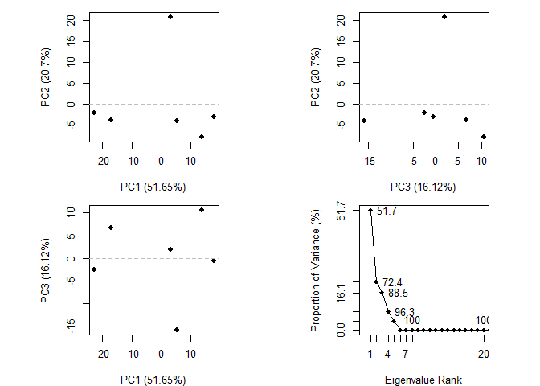

Class 11 - Structural Bioinformatics
================
Livia Songster
11/6/2019

# Section 1 - PDB statistics

Download CSV file from <http://www.rcsb.org/>

“Analyze” -\> “PDB Statistics” \> “by Experimental Method and Molecular
Type”

``` r
PDBdata <- read.csv("DataExportSummary.csv",header=TRUE)
PDBdata
```

    ##   Experimental.Method Proteins Nucleic.Acids Protein.NA.Complex Other
    ## 1               X-Ray   131463          2060               6768     8
    ## 2                 NMR    11241          1304                262     8
    ## 3 Electron Microscopy     2925            32               1004     0
    ## 4               Other      280             4                  6    13
    ## 5        Multi Method      144             5                  2     1
    ##    Total
    ## 1 140299
    ## 2  12815
    ## 3   3961
    ## 4    303
    ## 5    152

``` r
summary(PDBdata)
```

    ##           Experimental.Method    Proteins      Nucleic.Acids 
    ##  Electron Microscopy:1        Min.   :   144   Min.   :   4  
    ##  Multi Method       :1        1st Qu.:   280   1st Qu.:   5  
    ##  NMR                :1        Median :  2925   Median :  32  
    ##  Other              :1        Mean   : 29211   Mean   : 681  
    ##  X-Ray              :1        3rd Qu.: 11241   3rd Qu.:1304  
    ##                               Max.   :131463   Max.   :2060  
    ##  Protein.NA.Complex     Other        Total       
    ##  Min.   :   2       Min.   : 0   Min.   :   152  
    ##  1st Qu.:   6       1st Qu.: 1   1st Qu.:   303  
    ##  Median : 262       Median : 8   Median :  3961  
    ##  Mean   :1608       Mean   : 6   Mean   : 31506  
    ##  3rd Qu.:1004       3rd Qu.: 8   3rd Qu.: 12815  
    ##  Max.   :6768       Max.   :13   Max.   :140299

Q1A: proportion of structures solved by X-ray and electron microscopy

``` r
# X ray
(PDBdata[1,6] ) / sum(PDBdata[6]) * 100
```

    ## [1] 89.06177

``` r
# EM
(PDBdata[3,6] ) / sum(PDBdata[6]) * 100
```

    ## [1] 2.514442

``` r
# print all of them
ans <- PDBdata$Total / sum(PDBdata$Total) * 100
names(ans) <- PDBdata$Experimental.Method
round(ans,2)
```

    ##               X-Ray                 NMR Electron Microscopy 
    ##               89.06                8.13                2.51 
    ##               Other        Multi Method 
    ##                0.19                0.10

Q1B: proportion of structures that are proteins

``` r
# proteins only
sum(PDBdata[2]) / sum(PDBdata[6]) * 100
```

    ## [1] 92.7144

``` r
# all structure types
ans2<- as.vector(colSums(PDBdata[2:5]))/sum(PDBdata[6]) * 100
names(ans2) <- colnames(PDBdata[2:5])
round(ans2,2)
```

    ##           Proteins      Nucleic.Acids Protein.NA.Complex 
    ##              92.71               2.16               5.11 
    ##              Other 
    ##               0.02

Q2: Type HIV in the PDB website search box on the home page and
determine how many HIV-1 protease structures are in the current PDB

There are 3,048 published HIV structures in the current PDB.

# Section 2 - tutorial in VMD

See other files…

# Section 3 - Intro to Bio3D in R

To read a single PDB file with Bio3D we can use the read.pdb() function.
The minimal input required for this function is a specification of the
file to be read. This can be either the file name of a local file on
disc, or the RCSB PDB identifier of a file to read directly from the
on-line PDB repository (shown here).

``` r
library(bio3d)
pdb <- read.pdb("1hsg")
```

    ##   Note: Accessing on-line PDB file

``` r
# summary of pdb file
pdb
```

    ## 
    ##  Call:  read.pdb(file = "1hsg")
    ## 
    ##    Total Models#: 1
    ##      Total Atoms#: 1686,  XYZs#: 5058  Chains#: 2  (values: A B)
    ## 
    ##      Protein Atoms#: 1514  (residues/Calpha atoms#: 198)
    ##      Nucleic acid Atoms#: 0  (residues/phosphate atoms#: 0)
    ## 
    ##      Non-protein/nucleic Atoms#: 172  (residues: 128)
    ##      Non-protein/nucleic resid values: [ HOH (127), MK1 (1) ]
    ## 
    ##    Protein sequence:
    ##       PQITLWQRPLVTIKIGGQLKEALLDTGADDTVLEEMSLPGRWKPKMIGGIGGFIKVRQYD
    ##       QILIEICGHKAIGTVLVGPTPVNIIGRNLLTQIGCTLNFPQITLWQRPLVTIKIGGQLKE
    ##       ALLDTGADDTVLEEMSLPGRWKPKMIGGIGGFIKVRQYDQILIEICGHKAIGTVLVGPTP
    ##       VNIIGRNLLTQIGCTLNF
    ## 
    ## + attr: atom, xyz, seqres, helix, sheet,
    ##         calpha, remark, call

Q6. There are 198 amino acid residues and two nonprotein residues: HOH
(wateR) and MK1 (idinavir anti-HIV drug)

Next let’s check the attributes of the pdb file.

``` r
# list all attributes/objects within pdb
attributes(pdb)
```

    ## $names
    ## [1] "atom"   "xyz"    "seqres" "helix"  "sheet"  "calpha" "remark" "call"  
    ## 
    ## $class
    ## [1] "pdb" "sse"

``` r
# check the atom object within pdb
head(pdb$atom)
```

    ##   type eleno elety  alt resid chain resno insert      x      y     z o
    ## 1 ATOM     1     N <NA>   PRO     A     1   <NA> 29.361 39.686 5.862 1
    ## 2 ATOM     2    CA <NA>   PRO     A     1   <NA> 30.307 38.663 5.319 1
    ## 3 ATOM     3     C <NA>   PRO     A     1   <NA> 29.760 38.071 4.022 1
    ## 4 ATOM     4     O <NA>   PRO     A     1   <NA> 28.600 38.302 3.676 1
    ## 5 ATOM     5    CB <NA>   PRO     A     1   <NA> 30.508 37.541 6.342 1
    ## 6 ATOM     6    CG <NA>   PRO     A     1   <NA> 29.296 37.591 7.162 1
    ##       b segid elesy charge
    ## 1 38.10  <NA>     N   <NA>
    ## 2 40.62  <NA>     C   <NA>
    ## 3 42.64  <NA>     C   <NA>
    ## 4 43.40  <NA>     O   <NA>
    ## 5 37.87  <NA>     C   <NA>
    ## 6 38.40  <NA>     C   <NA>

``` r
# Q7: check structure of pdb$atom
str(pdb$atom)
```

    ## 'data.frame':    1686 obs. of  16 variables:
    ##  $ type  : chr  "ATOM" "ATOM" "ATOM" "ATOM" ...
    ##  $ eleno : int  1 2 3 4 5 6 7 8 9 10 ...
    ##  $ elety : chr  "N" "CA" "C" "O" ...
    ##  $ alt   : chr  NA NA NA NA ...
    ##  $ resid : chr  "PRO" "PRO" "PRO" "PRO" ...
    ##  $ chain : chr  "A" "A" "A" "A" ...
    ##  $ resno : int  1 1 1 1 1 1 1 2 2 2 ...
    ##  $ insert: chr  NA NA NA NA ...
    ##  $ x     : num  29.4 30.3 29.8 28.6 30.5 ...
    ##  $ y     : num  39.7 38.7 38.1 38.3 37.5 ...
    ##  $ z     : num  5.86 5.32 4.02 3.68 6.34 ...
    ##  $ o     : num  1 1 1 1 1 1 1 1 1 1 ...
    ##  $ b     : num  38.1 40.6 42.6 43.4 37.9 ...
    ##  $ segid : chr  NA NA NA NA ...
    ##  $ elesy : chr  "N" "C" "C" "O" ...
    ##  $ charge: chr  NA NA NA NA ...

``` r
# Print a subset of $atom data for the first two atoms
pdb$atom[1:2, c("eleno", "elety", "x","y","z")]
```

    ##   eleno elety      x      y     z
    ## 1     1     N 29.361 39.686 5.862
    ## 2     2    CA 30.307 38.663 5.319

``` r
# Note that individual $atom records can also be accessed like this
pdb$atom$elety[1:2]
```

    ## [1] "N"  "CA"

``` r
# Which allows us to do the following
plot.bio3d(pdb$atom$b[pdb$calpha], sse=pdb, typ="l", ylab="B-factor")
```

<!-- -->

``` r
# Print a summary of the coordinate data in $xyz
pdb$xyz
```

    ## 
    ##    Total Frames#: 1
    ##    Total XYZs#:   5058,  (Atoms#:  1686)
    ## 
    ##     [1]  29.361  39.686  5.862  <...>  30.112  17.912  -4.791  [5058] 
    ## 
    ## + attr: Matrix DIM = 1 x 5058

``` r
# Examine the row and column dimensions
dim(pdb$xyz)
```

    ## [1]    1 5058

``` r
# Print coordinates for the first two atoms
pdb$xyz[1, atom2xyz(1:2) ]
```

    ## [1] 29.361 39.686  5.862 30.307 38.663  5.319

# Section 4 - atom selection

For example to select the indices for all C-alpha atoms we can use the
following command:

``` r
# Select all C-alpha atoms (return their indices)
ca.inds <- atom.select(pdb, "calpha")
ca.inds
```

    ## 
    ##  Call:  atom.select.pdb(pdb = pdb, string = "calpha")
    ## 
    ##    Atom Indices#: 198  ($atom)
    ##    XYZ  Indices#: 594  ($xyz)
    ## 
    ## + attr: atom, xyz, call

``` r
# Print details of the first few selected atoms
head( pdb$atom[ca.inds$atom, ] )
```

    ##    type eleno elety  alt resid chain resno insert      x      y     z o
    ## 2  ATOM     2    CA <NA>   PRO     A     1   <NA> 30.307 38.663 5.319 1
    ## 9  ATOM     9    CA <NA>   GLN     A     2   <NA> 30.158 36.492 2.199 1
    ## 18 ATOM    18    CA <NA>   ILE     A     3   <NA> 29.123 33.098 3.397 1
    ## 26 ATOM    26    CA <NA>   THR     A     4   <NA> 29.774 30.143 1.062 1
    ## 33 ATOM    33    CA <NA>   LEU     A     5   <NA> 27.644 27.003 1.144 1
    ## 41 ATOM    41    CA <NA>   TRP     A     6   <NA> 30.177 24.150 1.279 1
    ##        b segid elesy charge
    ## 2  40.62  <NA>     C   <NA>
    ## 9  41.30  <NA>     C   <NA>
    ## 18 34.13  <NA>     C   <NA>
    ## 26 30.14  <NA>     C   <NA>
    ## 33 30.12  <NA>     C   <NA>
    ## 41 30.82  <NA>     C   <NA>

``` r
# And selected xyz coordinates
head( pdb$xyz[, ca.inds$xyz] )
```

    ## [1] 30.307 38.663  5.319 30.158 36.492  2.199

In addition to the common selection strings (such as ‘calpha’ ‘cbeta’
‘backbone’ ‘protein’ ‘notprotein’ ‘ligand’ ‘water’ ‘notwater’ ‘h’ and
‘noh’) various individual atom properties can be used, and combined,
for more fine grained selection.

``` r
# Select chain A
a.inds <- atom.select(pdb, chain="A")

# Select C-alphas of chain A
ca.inds <- atom.select(pdb, "calpha", chain="A")

# We can combine multiple selection criteria to return their intersection
cab.inds <- atom.select(pdb, elety=c("CA","CB"), chain="A",
resno=10:20)
cab.inds
```

    ## 
    ##  Call:  atom.select.pdb(pdb = pdb, elety = c("CA", "CB"), chain = "A", 
    ##     resno = 10:20)
    ## 
    ##    Atom Indices#: 20  ($atom)
    ##    XYZ  Indices#: 60  ($xyz)
    ## 
    ## + attr: atom, xyz, call

PDB object trimming: output a protein only PDB file for viewing in VMD.

``` r
proteinonly <- atom.select(pdb, "protein",value=TRUE)
write.pdb(proteinonly,"1hsg-proteinonly.pdb")
```

Second object: ligand with residue name MK1 only

``` r
mk1only <- atom.select(pdb, "ligand",value=TRUE)
write.pdb(mk1only,"1hsg-mk1only.pdb")
```

# Section 5 - 3D structure viewing in R

The ‘devtools’ package allows us to install development versions

install.packages(“devtools”)

Also install the bio3d.view package from bitbucket

devtools::install\_bitbucket(“Grantlab/bio3d-view”)

``` r
# Load the package
library("bio3d.view")

# The rglwidget() function from the rgl
# package will show output in your Rmd
# notebook and rendered html_output
# documents
library(rgl)


# view the 3D structure
view(pdb, "overview", col="sse")
```

    ## Computing connectivity from coordinates...

``` r
#rglwidget()

# view 3D structure of mk1 only
view(mk1only, "overview", col="sse")
#rglwidget()

# view protein only
view(proteinonly, "overview", col="sse")
```

    ## Computing connectivity from coordinates...

``` r
#rglwidget()
```

Next we can run a normal mode analysis to predict the major motions of
biomolecules. This takes some time to run.

``` r
# Load the pdb file
pdb <- read.pdb("1hel")
```

    ##   Note: Accessing on-line PDB file

``` r
# Normal mode analysis calculation with nma()
modes <- nma(pdb)
```

    ##  Building Hessian...     Done in 0 seconds.
    ##  Diagonalizing Hessian...    Done in 0.07 seconds.

``` r
# next apply this calculation to the pdb file and normal calculated atom trajectories
m7 <- mktrj(modes,
 mode=7,
 file="mode_7.pdb")

# view the NMA calculation
view(m7, col=vec2color( rmsf(m7) ))
```

    ## Potential all C-alpha atom structure(s) detected: Using calpha.connectivity()

# Section 6 - working with multiple PDB files

For this section, I downloaded muscle.exe into my current RStudio
project directory on terminal.

Next let’s download example PDB files and align them. The get.pdb()
function will download the requested files. Argument split = TRUE
requests further that we want to extract particular chains, i.e. those
specified by the \_A suffix of each PDB ID in the example above.

``` r
# Download some example PDB files
ids <- c("1TND_B","1AGR_A","1TAG_A","1GG2_A","1KJY_A","4G5Q_A")
files <- get.pdb(ids, split = TRUE)
```

    ## Warning in get.pdb(ids, split = TRUE): ./1TND.pdb exists. Skipping download

    ## Warning in get.pdb(ids, split = TRUE): ./1AGR.pdb exists. Skipping download

    ## Warning in get.pdb(ids, split = TRUE): ./1TAG.pdb exists. Skipping download

    ## Warning in get.pdb(ids, split = TRUE): ./1GG2.pdb exists. Skipping download

    ## Warning in get.pdb(ids, split = TRUE): ./1KJY.pdb exists. Skipping download

    ## Warning in get.pdb(ids, split = TRUE): ./4G5Q.pdb exists. Skipping download

    ## 
      |                                                                       
      |                                                                 |   0%
      |                                                                       
      |===========                                                      |  17%
      |                                                                       
      |======================                                           |  33%
      |                                                                       
      |================================                                 |  50%
      |                                                                       
      |===========================================                      |  67%
      |                                                                       
      |======================================================           |  83%
      |                                                                       
      |=================================================================| 100%

``` r
# Extract and align the chains we are interested in
pdbs <- pdbaln(files, fit = TRUE)
```

    ## Reading PDB files:
    ## ./split_chain/1TND_B.pdb
    ## ./split_chain/1AGR_A.pdb
    ## ./split_chain/1TAG_A.pdb
    ## ./split_chain/1GG2_A.pdb
    ## ./split_chain/1KJY_A.pdb
    ## ./split_chain/4G5Q_A.pdb
    ## .....   PDB has ALT records, taking A only, rm.alt=TRUE
    ## .
    ## 
    ## Extracting sequences
    ## 
    ## pdb/seq: 1   name: ./split_chain/1TND_B.pdb 
    ## pdb/seq: 2   name: ./split_chain/1AGR_A.pdb 
    ## pdb/seq: 3   name: ./split_chain/1TAG_A.pdb 
    ## pdb/seq: 4   name: ./split_chain/1GG2_A.pdb 
    ## pdb/seq: 5   name: ./split_chain/1KJY_A.pdb 
    ## pdb/seq: 6   name: ./split_chain/4G5Q_A.pdb 
    ##    PDB has ALT records, taking A only, rm.alt=TRUE

``` r
# Print to screen a summary of the 'pdbs' object
pdbs
```

    ##                                1        .         .         .         .         50 
    ## [Truncated_Name:1]1TND_B.pdb   --------------------------ARTVKLLLLGAGESGKSTIVKQMK
    ## [Truncated_Name:2]1AGR_A.pdb   LSAEDKAAVERSKMIDRNLREDGEKAAREVKLLLLGAGESGKSTIVKQMK
    ## [Truncated_Name:3]1TAG_A.pdb   --------------------------ARTVKLLLLGAGESGKSTIVKQMK
    ## [Truncated_Name:4]1GG2_A.pdb   LSAEDKAAVERSKMIDRNLREDGEKAAREVKLLLLGAGESGKSTIVKQMK
    ## [Truncated_Name:5]1KJY_A.pdb   -------------------------GAREVKLLLLGAGESGKSTIVKQMK
    ## [Truncated_Name:6]4G5Q_A.pdb   --------------------------AREVKLLLLGAGESGKSTIVKQMK
    ##                                                          ** ********************* 
    ##                                1        .         .         .         .         50 
    ## 
    ##                               51        .         .         .         .         100 
    ## [Truncated_Name:1]1TND_B.pdb   IIHQDGYSLEECLEFIAIIYGNTLQSILAIVRAMTTLNIQYGDSARQDDA
    ## [Truncated_Name:2]1AGR_A.pdb   IIHEAGYSEEECKQYKAVVYSNTIQSIIAIIRAMGRLKIDFGDAARADDA
    ## [Truncated_Name:3]1TAG_A.pdb   IIHQDGYSLEECLEFIAIIYGNTLQSILAIVRAMTTLNIQYGDSARQDDA
    ## [Truncated_Name:4]1GG2_A.pdb   IIHEAGYSEEECKQYKAVVYSNTIQSIIAIIRAMGRLKIDFGDAARADDA
    ## [Truncated_Name:5]1KJY_A.pdb   IIHEAGYSEEECKQYKAVVYSNTIQSIIAIIRAMGRLKIDFGDSARADDA
    ## [Truncated_Name:6]4G5Q_A.pdb   IIHEAGYSEEECKQYKAVVYSNTIQSIIAIIRAMGRLKIDFGDSARADDA
    ##                                ***  *** ***  ^ *^^* **^***^**^***  * * ^** ** *** 
    ##                               51        .         .         .         .         100 
    ## 
    ##                              101        .         .         .         .         150 
    ## [Truncated_Name:1]1TND_B.pdb   RKLMHMADTIEEGTMPKEMSDIIQRLWKDSGIQACFDRASEYQLNDSAGY
    ## [Truncated_Name:2]1AGR_A.pdb   RQLFVLAGAAEEGFMTAELAGVIKRLWKDSGVQACFNRSREYQLNDSAAY
    ## [Truncated_Name:3]1TAG_A.pdb   RKLMHMADTIEEGTMPKEMSDIIQRLWKDSGIQACFDRASEYQLNDSAGY
    ## [Truncated_Name:4]1GG2_A.pdb   RQLFVLAGAAEEGFMTAELAGVIKRLWKDSGVQACFNRSREYQLNDSAAY
    ## [Truncated_Name:5]1KJY_A.pdb   RQLFVLAGAAEEGFMTAELAGVIKRLWKDSGVQACFNRSREYQLNDSAAY
    ## [Truncated_Name:6]4G5Q_A.pdb   RQLFVLAGAAEEGFMTAELAGVIKRLWKDSGVQACFNRSREYQLNDSAAY
    ##                                * *  ^*   *** *  *^  ^* *******^**** *  ********^* 
    ##                              101        .         .         .         .         150 
    ## 
    ##                              151        .         .         .         .         200 
    ## [Truncated_Name:1]1TND_B.pdb   YLSDLERLVTPGYVPTEQDVLRSRVKTTGIIETQFSFKDLNFRMFDVGGQ
    ## [Truncated_Name:2]1AGR_A.pdb   YLNDLDRIAQPNYIPTQQDVLRTRVKTTGIVETHFTFKDLHFKMFDVGGQ
    ## [Truncated_Name:3]1TAG_A.pdb   YLSDLERLVTPGYVPTEQDVLRSRVKTTGIIETQFSFKDLNFRMFDVGGQ
    ## [Truncated_Name:4]1GG2_A.pdb   YLNDLDRIAQPNYIPTQQDVLRTRVKTTGIVETHFTFKDLHFKMFDVGAQ
    ## [Truncated_Name:5]1KJY_A.pdb   YLNDLDRIAQPNYIPTQQDVLRTRVKTTGIVETHFTFKDLHFKMFDVGGQ
    ## [Truncated_Name:6]4G5Q_A.pdb   YLNDLDRIAQPNYIPTQQDVLRTRVKTTGIVETHFTFKDLHFKMFDVGGQ
    ##                                ** **^*^  * *^** *****^*******^** *^**** *^*****^* 
    ##                              151        .         .         .         .         200 
    ## 
    ##                              201        .         .         .         .         250 
    ## [Truncated_Name:1]1TND_B.pdb   RSERKKWIHCFEGVTCIIFIAALSAYDMVLVEDDEVNRMHESLHLFNSIC
    ## [Truncated_Name:2]1AGR_A.pdb   RSERKKWIHCFEGVTAIIFCVALSDYDLVLAEDEEMNRMHESMKLFDSIC
    ## [Truncated_Name:3]1TAG_A.pdb   RSERKKWIHCFEGVTCIIFIAALSAYDMVLVEDDEVNRMHESLHLFNSIC
    ## [Truncated_Name:4]1GG2_A.pdb   RSERKKWIHCFEGVTAIIFCVALSDYDLVLAEDEEMNRMHESMKLFDSIC
    ## [Truncated_Name:5]1KJY_A.pdb   RSERKKWIHCFEGVTAIIFCVALSDYDLVLAEDEEMNRMHESMKLFDSIC
    ## [Truncated_Name:6]4G5Q_A.pdb   RSERKKWIHCFEGVTAIIFCVALSDYDLVLAEDEEMNRMHESMKLFDSIC
    ##                                *************** ***  *** **^** **^*^******^^** *** 
    ##                              201        .         .         .         .         250 
    ## 
    ##                              251        .         .         .         .         300 
    ## [Truncated_Name:1]1TND_B.pdb   NHRYFATTSIVLFLNKKDVFSEKIKKAHLSICFPDYNGPNTYEDAGNYIK
    ## [Truncated_Name:2]1AGR_A.pdb   NNKWFTDTSIILFLNKKDLFEEKIKKSPLTICYPEYAGSNTYEEAAAYIQ
    ## [Truncated_Name:3]1TAG_A.pdb   NHRYFATTSIVLFLNKKDVFSEKIKKAHLSICFPDYNGPNTYEDAGNYIK
    ## [Truncated_Name:4]1GG2_A.pdb   NNKWFTDTSIILFLNKKDLFEEKIKKSPLTICYPEYAGSNTYEEAAAYIQ
    ## [Truncated_Name:5]1KJY_A.pdb   NNKWFTDTSIILFLNKKDLFEEKIKKSPLTICYPEYAGSNTYEEAAAYIQ
    ## [Truncated_Name:6]4G5Q_A.pdb   NNKWFTDTSIILFLNKKDLFEEKIKKSPLTICYPEYAGSNTYEEAAAYIQ
    ##                                * ^^*  ***^*******^* *****  *^**^*^* * ****^*^ **  
    ##                              251        .         .         .         .         300 
    ## 
    ##                              301        .         .         .         .         350 
    ## [Truncated_Name:1]1TND_B.pdb   VQFLELNMRRDVKEIYSHMTCATDTQNVKFVFDAVTDIIIKE--------
    ## [Truncated_Name:2]1AGR_A.pdb   CQFEDLNKRKDTKEIYTHFTCATDTKNVQFVFDAVTDVIIKNNLKDCGLF
    ## [Truncated_Name:3]1TAG_A.pdb   VQFLELNMRRDVKEIYSHMTCATDTQNVKFVFDAVTDIII----------
    ## [Truncated_Name:4]1GG2_A.pdb   CQFEDLNKRKDTKEIYTHFTCATDTKNVQFVFDAVTDVIIKNNL------
    ## [Truncated_Name:5]1KJY_A.pdb   CQFEDLNKRKDTKEIYTHFTCATDTKNVQFVFDAVTDVIIKNNLK-----
    ## [Truncated_Name:6]4G5Q_A.pdb   CQFEDLNKRKDTKEIYTHFTCATDTKNVQFVFDAVTDVIIKNNLKD----
    ##                                 ** ^** *^* ****^* ****** ** ********^**           
    ##                              301        .         .         .         .         350 
    ## 
    ## Call:
    ##   pdbaln(files = files, fit = TRUE)
    ## 
    ## Class:
    ##   pdbs, fasta
    ## 
    ## Alignment dimensions:
    ##   6 sequence rows; 350 position columns (314 non-gap, 36 gap) 
    ## 
    ## + attr: xyz, resno, b, chain, id, ali, resid, sse, call

``` r
#  Access the first 5 rows, and 8 columns
pdbs$ali[1:5, 1:8]
```

    ##                          [,1] [,2] [,3] [,4] [,5] [,6] [,7] [,8]
    ## ./split_chain/1TND_B.pdb "-"  "-"  "-"  "-"  "-"  "-"  "-"  "-" 
    ## ./split_chain/1AGR_A.pdb "L"  "S"  "A"  "E"  "D"  "K"  "A"  "A" 
    ## ./split_chain/1TAG_A.pdb "-"  "-"  "-"  "-"  "-"  "-"  "-"  "-" 
    ## ./split_chain/1GG2_A.pdb "L"  "S"  "A"  "E"  "D"  "K"  "A"  "A" 
    ## ./split_chain/1KJY_A.pdb "-"  "-"  "-"  "-"  "-"  "-"  "-"  "-"

``` r
# Associated residues numbers
pdbs$resno[1:5, 1:8]
```

    ##                          [,1] [,2] [,3] [,4] [,5] [,6] [,7] [,8]
    ## ./split_chain/1TND_B.pdb   NA   NA   NA   NA   NA   NA   NA   NA
    ## ./split_chain/1AGR_A.pdb    5    6    7    8    9   10   11   12
    ## ./split_chain/1TAG_A.pdb   NA   NA   NA   NA   NA   NA   NA   NA
    ## ./split_chain/1GG2_A.pdb    5    6    7    8    9   10   11   12
    ## ./split_chain/1KJY_A.pdb   NA   NA   NA   NA   NA   NA   NA   NA

``` r
# access row names/pdb names
basename.pdb(pdbs$id)
```

    ## ./split_chain/1TND_B.pdb ./split_chain/1AGR_A.pdb ./split_chain/1TAG_A.pdb 
    ##                 "1TND_B"                 "1AGR_A"                 "1TAG_A" 
    ## ./split_chain/1GG2_A.pdb ./split_chain/1KJY_A.pdb ./split_chain/4G5Q_A.pdb 
    ##                 "1GG2_A"                 "1KJY_A"                 "4G5Q_A"

# 6.3 Basic structure analysis

Having the generated pdbs object at hand facilitates a range of
possibilities for protein structure analysis. This includes sequence
identity/similarity, structural deviation, rigid core identification as
well as principal component and normal mode analysis. Several Bio3D
function are specifically designed to operate on the pdbs object,
including functions seqidentity(), rmsd(), pca(), core.find(), nma() and
many others.

Below we calculate the pairwise sequence identity between the structures
of the pdbs ensemble followed by the root mean square deviation (RMSD):

``` r
# Calculate sequence identity
seqidentity(pdbs)
```

    ##                          ./split_chain/1TND_B.pdb ./split_chain/1AGR_A.pdb
    ## ./split_chain/1TND_B.pdb                    1.000                    0.693
    ## ./split_chain/1AGR_A.pdb                    0.693                    1.000
    ## ./split_chain/1TAG_A.pdb                    1.000                    0.694
    ## ./split_chain/1GG2_A.pdb                    0.690                    0.997
    ## ./split_chain/1KJY_A.pdb                    0.696                    0.994
    ## ./split_chain/4G5Q_A.pdb                    0.696                    0.997
    ##                          ./split_chain/1TAG_A.pdb ./split_chain/1GG2_A.pdb
    ## ./split_chain/1TND_B.pdb                    1.000                    0.690
    ## ./split_chain/1AGR_A.pdb                    0.694                    0.997
    ## ./split_chain/1TAG_A.pdb                    1.000                    0.691
    ## ./split_chain/1GG2_A.pdb                    0.691                    1.000
    ## ./split_chain/1KJY_A.pdb                    0.697                    0.991
    ## ./split_chain/4G5Q_A.pdb                    0.697                    0.994
    ##                          ./split_chain/1KJY_A.pdb ./split_chain/4G5Q_A.pdb
    ## ./split_chain/1TND_B.pdb                    0.696                    0.696
    ## ./split_chain/1AGR_A.pdb                    0.994                    0.997
    ## ./split_chain/1TAG_A.pdb                    0.697                    0.697
    ## ./split_chain/1GG2_A.pdb                    0.991                    0.994
    ## ./split_chain/1KJY_A.pdb                    1.000                    1.000
    ## ./split_chain/4G5Q_A.pdb                    1.000                    1.000

``` r
# Calculate RMSD
rd <- rmsd(pdbs)
```

    ## Warning in rmsd(pdbs): No indices provided, using the 314 non NA positions

``` r
rd
```

    ##       [,1]  [,2]  [,3]  [,4]  [,5]  [,6]
    ## [1,] 0.000 1.042 1.281 1.651 2.098 2.367
    ## [2,] 1.042 0.000 1.628 1.811 1.949 2.244
    ## [3,] 1.281 1.628 0.000 1.730 1.840 1.885
    ## [4,] 1.651 1.811 1.730 0.000 1.901 2.032
    ## [5,] 2.098 1.949 1.840 1.901 0.000 1.225
    ## [6,] 2.367 2.244 1.885 2.032 1.225 0.000

``` r
# Clustering
hc <- hclust(as.dist(rd))
grps <- cutree(hc, k=3)
# Plot results as dendrogram
hclustplot(hc, k=3)
```

<!-- -->

# Principal component analysis on multiple protein structures

``` r
# Perform PCA
pc.xray <- pca(pdbs)
# Plot our results summary (PCA score plot and scree-plot)
plot(pc.xray)
```

<!-- -->

``` r
# Visualize first principal component
pc1 <- mktrj(pc.xray, pc=1, file="pc_1.pdb")

# view it in R
library("bio3d.view")
# Structural displacements captured by PC1
view(pc1)
```

    ## Potential all C-alpha atom structure(s) detected: Using calpha.connectivity()

``` r
#rglwidget()
```
