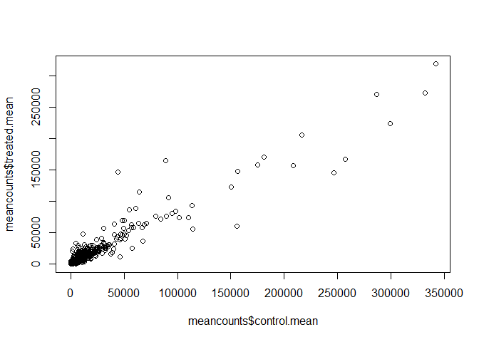
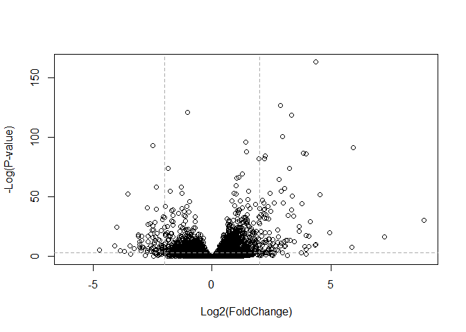

Class 14 - Transcriptomics and RNA-Seq Analysis
================
Livia Songster
11/13/2019

# Import countData and colData

``` r
# read in countData
counts <- read.csv("airway_scaledcounts.csv", stringsAsFactors = FALSE)
# read in metadata/colData
metadata <-  read.csv("airway_metadata.csv", stringsAsFactors = FALSE)

# check out the tables
head(counts)
```

    ##           ensgene SRR1039508 SRR1039509 SRR1039512 SRR1039513 SRR1039516
    ## 1 ENSG00000000003        723        486        904        445       1170
    ## 2 ENSG00000000005          0          0          0          0          0
    ## 3 ENSG00000000419        467        523        616        371        582
    ## 4 ENSG00000000457        347        258        364        237        318
    ## 5 ENSG00000000460         96         81         73         66        118
    ## 6 ENSG00000000938          0          0          1          0          2
    ##   SRR1039517 SRR1039520 SRR1039521
    ## 1       1097        806        604
    ## 2          0          0          0
    ## 3        781        417        509
    ## 4        447        330        324
    ## 5         94        102         74
    ## 6          0          0          0

``` r
head(metadata)
```

    ##           id     dex celltype     geo_id
    ## 1 SRR1039508 control   N61311 GSM1275862
    ## 2 SRR1039509 treated   N61311 GSM1275863
    ## 3 SRR1039512 control  N052611 GSM1275866
    ## 4 SRR1039513 treated  N052611 GSM1275867
    ## 5 SRR1039516 control  N080611 GSM1275870
    ## 6 SRR1039517 treated  N080611 GSM1275871

# Perform some exploratory differential gene expression analysis

Note: for demonstration only\!\!\!

``` r
# find control cell lines
control <- metadata[metadata[,"dex"]=="control",]
# find mean for all control cell lines
control.mean <- rowSums( counts[ ,control$id] )/4 
# add gene names
names(control.mean) <- counts$ensgene
# repeat for treated cell lines
treated <- metadata[metadata[,"dex"]=="treated",]
treated.mean <- rowSums( counts[ ,treated$id] )/4 
names(treated.mean) <- counts$ensgene

# We will combine our meancount data for bookkeeping purposes.
meancounts <- data.frame(control.mean, treated.mean)
# Directly compare sum of mean counts across all genes for each group
colSums(meancounts)
```

    ## control.mean treated.mean 
    ##     23005324     22196524

``` r
# create scatter plot showing mean of treated samples vs. control samples
plot(meancounts$control.mean,meancounts$treated.mean)
```

<!-- -->

``` r
# add log scale for both axes
plot(meancounts$control.mean,meancounts$treated.mean,log="xy")
```

    ## Warning in xy.coords(x, y, xlabel, ylabel, log): 15032 x values <= 0
    ## omitted from logarithmic plot

    ## Warning in xy.coords(x, y, xlabel, ylabel, log): 15281 y values <= 0
    ## omitted from logarithmic plot

<!-- -->

Identify candidate differentially expressed genes by looking for large
fold change between control and dex-treated samples (log2foldchange)

``` r
# calculate log2 fold change
meancounts$log2fc <- log2(meancounts[,"treated.mean"]/meancounts[,"control.mean"])
head(meancounts)
```

    ##                 control.mean treated.mean      log2fc
    ## ENSG00000000003       900.75       658.00 -0.45303916
    ## ENSG00000000005         0.00         0.00         NaN
    ## ENSG00000000419       520.50       546.00  0.06900279
    ## ENSG00000000457       339.75       316.50 -0.10226805
    ## ENSG00000000460        97.25        78.75 -0.30441833
    ## ENSG00000000938         0.75         0.00        -Inf

``` r
# filter our data to remove NaN and -Inf results
# find which rows and columns have a mean count of zero
zero.vals <- which(meancounts[,1:2]==0, arr.ind=TRUE)
# identify which rows are unique (in case there are duplicates)
to.rm <- unique(zero.vals[,1])
# now exclude these rows from meancounts
mycounts <- meancounts[-to.rm,]
head(mycounts)
```

    ##                 control.mean treated.mean      log2fc
    ## ENSG00000000003       900.75       658.00 -0.45303916
    ## ENSG00000000419       520.50       546.00  0.06900279
    ## ENSG00000000457       339.75       316.50 -0.10226805
    ## ENSG00000000460        97.25        78.75 -0.30441833
    ## ENSG00000000971      5219.00      6687.50  0.35769358
    ## ENSG00000001036      2327.00      1785.75 -0.38194109

A common threshold used for calling something differentially expressed
is a log2(FoldChange) of greater than 2 or less than -2. Let’s filter
the dataset both ways to see how many genes are up or down-regulated.

``` r
up.ind <- mycounts$log2fc > 2
down.ind <- mycounts$log2fc < (-2)
# count how many upregulated genes there are
table(up.ind)
```

    ## up.ind
    ## FALSE  TRUE 
    ## 21567   250

``` r
# now count downregulated genes
table(down.ind)
```

    ## down.ind
    ## FALSE  TRUE 
    ## 21450   367

# Adding annotation data (metadata)

We can add annotation from a supplied CSV file, such as those available
from ENSEMBLE or UCSC. The annotables\_grch38.csv annotation table links
the unambiguous Ensembl gene ID to other useful annotation like the gene
symbol, full gene name, location, Entrez gene ID, etc.

``` r
anno <- read.csv("annotables_grch38.csv")
head(anno)
```

    ##           ensgene entrez   symbol chr     start       end strand
    ## 1 ENSG00000000003   7105   TSPAN6   X 100627109 100639991     -1
    ## 2 ENSG00000000005  64102     TNMD   X 100584802 100599885      1
    ## 3 ENSG00000000419   8813     DPM1  20  50934867  50958555     -1
    ## 4 ENSG00000000457  57147    SCYL3   1 169849631 169894267     -1
    ## 5 ENSG00000000460  55732 C1orf112   1 169662007 169854080      1
    ## 6 ENSG00000000938   2268      FGR   1  27612064  27635277     -1
    ##          biotype
    ## 1 protein_coding
    ## 2 protein_coding
    ## 3 protein_coding
    ## 4 protein_coding
    ## 5 protein_coding
    ## 6 protein_coding
    ##                                                                                                  description
    ## 1                                                          tetraspanin 6 [Source:HGNC Symbol;Acc:HGNC:11858]
    ## 2                                                            tenomodulin [Source:HGNC Symbol;Acc:HGNC:17757]
    ## 3 dolichyl-phosphate mannosyltransferase polypeptide 1, catalytic subunit [Source:HGNC Symbol;Acc:HGNC:3005]
    ## 4                                               SCY1-like, kinase-like 3 [Source:HGNC Symbol;Acc:HGNC:19285]
    ## 5                                    chromosome 1 open reading frame 112 [Source:HGNC Symbol;Acc:HGNC:25565]
    ## 6                          FGR proto-oncogene, Src family tyrosine kinase [Source:HGNC Symbol;Acc:HGNC:3697]

``` r
# merge annotations and counts by gene ID (ensgene) and row names (0)
anno.mycounts <- merge(x=anno,y=mycounts,by.x="ensgene",by.y=0)
```

In cases where you don’t have a preferred annotation file at hand you
can use other Bioconductor packages for annotation.

Bioconductor’s annotation packages help with mapping various ID schemes
to each other. Here we load the AnnotationDbi package and the annotation
package org.Hs.eg.db.

``` r
library("AnnotationDbi")
```

    ## Loading required package: stats4

    ## Loading required package: BiocGenerics

    ## Loading required package: parallel

    ## 
    ## Attaching package: 'BiocGenerics'

    ## The following objects are masked from 'package:parallel':
    ## 
    ##     clusterApply, clusterApplyLB, clusterCall, clusterEvalQ,
    ##     clusterExport, clusterMap, parApply, parCapply, parLapply,
    ##     parLapplyLB, parRapply, parSapply, parSapplyLB

    ## The following objects are masked from 'package:stats':
    ## 
    ##     IQR, mad, sd, var, xtabs

    ## The following objects are masked from 'package:base':
    ## 
    ##     anyDuplicated, append, as.data.frame, basename, cbind,
    ##     colMeans, colnames, colSums, dirname, do.call, duplicated,
    ##     eval, evalq, Filter, Find, get, grep, grepl, intersect,
    ##     is.unsorted, lapply, lengths, Map, mapply, match, mget, order,
    ##     paste, pmax, pmax.int, pmin, pmin.int, Position, rank, rbind,
    ##     Reduce, rowMeans, rownames, rowSums, sapply, setdiff, sort,
    ##     table, tapply, union, unique, unsplit, which, which.max,
    ##     which.min

    ## Loading required package: Biobase

    ## Welcome to Bioconductor
    ## 
    ##     Vignettes contain introductory material; view with
    ##     'browseVignettes()'. To cite Bioconductor, see
    ##     'citation("Biobase")', and for packages 'citation("pkgname")'.

    ## Loading required package: IRanges

    ## Loading required package: S4Vectors

    ## 
    ## Attaching package: 'S4Vectors'

    ## The following object is masked from 'package:base':
    ## 
    ##     expand.grid

    ## 
    ## Attaching package: 'IRanges'

    ## The following object is masked from 'package:grDevices':
    ## 
    ##     windows

``` r
library("org.Hs.eg.db")
```

    ## 

This is the organism annotation package (“org”) for Homo sapiens (“Hs”),
organized as an AnnotationDbi database package (“db”), using Entrez Gene
IDs (“eg”) as primary key. To get a list of all available key types,
use:

``` r
columns(org.Hs.eg.db)
```

    ##  [1] "ACCNUM"       "ALIAS"        "ENSEMBL"      "ENSEMBLPROT" 
    ##  [5] "ENSEMBLTRANS" "ENTREZID"     "ENZYME"       "EVIDENCE"    
    ##  [9] "EVIDENCEALL"  "GENENAME"     "GO"           "GOALL"       
    ## [13] "IPI"          "MAP"          "OMIM"         "ONTOLOGY"    
    ## [17] "ONTOLOGYALL"  "PATH"         "PFAM"         "PMID"        
    ## [21] "PROSITE"      "REFSEQ"       "SYMBOL"       "UCSCKG"      
    ## [25] "UNIGENE"      "UNIPROT"

``` r
# We can use the mapIds() function to add individual columns to our results table.
mycounts$symbol <- mapIds(org.Hs.eg.db,
                     keys=row.names(mycounts), # Our gene names
                     keytype="ENSEMBL",        # The format of our gene names
                     column="SYMBOL",          # The new format we want to add
                     multiVals="first")        # Return the first value in the database
```

    ## 'select()' returned 1:many mapping between keys and columns

``` r
head(mycounts)
```

    ##                 control.mean treated.mean      log2fc   symbol
    ## ENSG00000000003       900.75       658.00 -0.45303916   TSPAN6
    ## ENSG00000000419       520.50       546.00  0.06900279     DPM1
    ## ENSG00000000457       339.75       316.50 -0.10226805    SCYL3
    ## ENSG00000000460        97.25        78.75 -0.30441833 C1orf112
    ## ENSG00000000971      5219.00      6687.50  0.35769358      CFH
    ## ENSG00000001036      2327.00      1785.75 -0.38194109    FUCA2

``` r
# Now run the mapIds() function two more times to add the Entrez ID and UniProt accession as new columns called mycounts$entrez and mycounts$uniprot
mycounts$entrez <- mapIds(org.Hs.eg.db,
                     keys=row.names(mycounts), 
                     keytype="ENSEMBL", 
                     column="ENTREZID", 
                     multiVals="first")
```

    ## 'select()' returned 1:many mapping between keys and columns

``` r
mycounts$uniprot <- mapIds(org.Hs.eg.db,
                     keys=row.names(mycounts), 
                     keytype="ENSEMBL", 
                     column="UNIPROT", 
                     multiVals="first")
```

    ## 'select()' returned 1:many mapping between keys and columns

``` r
head(mycounts)
```

    ##                 control.mean treated.mean      log2fc   symbol entrez
    ## ENSG00000000003       900.75       658.00 -0.45303916   TSPAN6   7105
    ## ENSG00000000419       520.50       546.00  0.06900279     DPM1   8813
    ## ENSG00000000457       339.75       316.50 -0.10226805    SCYL3  57147
    ## ENSG00000000460        97.25        78.75 -0.30441833 C1orf112  55732
    ## ENSG00000000971      5219.00      6687.50  0.35769358      CFH   3075
    ## ENSG00000001036      2327.00      1785.75 -0.38194109    FUCA2   2519
    ##                    uniprot
    ## ENSG00000000003 A0A024RCI0
    ## ENSG00000000419     O60762
    ## ENSG00000000457     Q8IZE3
    ## ENSG00000000460 A0A024R922
    ## ENSG00000000971 A0A024R962
    ## ENSG00000001036     Q9BTY2

Examine the annotated results for those genes with a log2(FoldChange) of
greater than 2 (or less than -2 if you prefer)

``` r
# View( mycounts[up.ind,] )
# View( mycounts[down.ind,] )
```

There are several genes that have NA gene symbols/uniprot/entrez
annotations.

# DESeq2 analysis

Proper differential expression analysis: load DESeq2 and check the
citation.

``` r
library(DESeq2)
```

    ## Loading required package: GenomicRanges

    ## Loading required package: GenomeInfoDb

    ## Loading required package: SummarizedExperiment

    ## Loading required package: DelayedArray

    ## Loading required package: matrixStats

    ## 
    ## Attaching package: 'matrixStats'

    ## The following objects are masked from 'package:Biobase':
    ## 
    ##     anyMissing, rowMedians

    ## Loading required package: BiocParallel

    ## 
    ## Attaching package: 'DelayedArray'

    ## The following objects are masked from 'package:matrixStats':
    ## 
    ##     colMaxs, colMins, colRanges, rowMaxs, rowMins, rowRanges

    ## The following objects are masked from 'package:base':
    ## 
    ##     aperm, apply

``` r
citation("DESeq2")
```

    ## 
    ##   Love, M.I., Huber, W., Anders, S. Moderated estimation of fold
    ##   change and dispersion for RNA-seq data with DESeq2 Genome
    ##   Biology 15(12):550 (2014)
    ## 
    ## A BibTeX entry for LaTeX users is
    ## 
    ##   @Article{,
    ##     title = {Moderated estimation of fold change and dispersion for RNA-seq data with DESeq2},
    ##     author = {Michael I. Love and Wolfgang Huber and Simon Anders},
    ##     year = {2014},
    ##     journal = {Genome Biology},
    ##     doi = {10.1186/s13059-014-0550-8},
    ##     volume = {15},
    ##     issue = {12},
    ##     pages = {550},
    ##   }

DESeq works on a particular type of object called a DESeqDataSet. The
DESeqDataSet is a single object that contains input values, intermediate
calculations like how things are normalized, and all results of a
differential expression analysis.

I can construct a DESeqDataSet from (1) a count matrix, (2) a metadata
file, and (3) a formula indicating the design of the experiment.

A design formula tells DESeq2 which columns in the sample information
table (colData) specify the experimental design (i.e. which groups the
samples belong to) and how these factors should be used in the analysis.
Essentially, this formula expresses how the counts for each gene depend
on the variables in colData.

In the metadata object, I am interested in the dex column, which tells
us which samples are treated with dexamethasone versus which samples are
untreated controls.

``` r
dds <- DESeqDataSetFromMatrix(countData=counts, # define counts (raw reads)
                              colData=metadata, # define metadata (originally loaded)
                              design=~dex,      # design formula; in this case, control vs. treated
                              tidy=TRUE)
```

    ## converting counts to integer mode

    ## Warning in DESeqDataSet(se, design = design, ignoreRank): some variables in
    ## design formula are characters, converting to factors

``` r
dds
```

    ## class: DESeqDataSet 
    ## dim: 38694 8 
    ## metadata(1): version
    ## assays(1): counts
    ## rownames(38694): ENSG00000000003 ENSG00000000005 ...
    ##   ENSG00000283120 ENSG00000283123
    ## rowData names(0):
    ## colnames(8): SRR1039508 SRR1039509 ... SRR1039520 SRR1039521
    ## colData names(4): id dex celltype geo_id

# DESeq pipeline

dds is a bare-bones DESeqDataSet. The DESeq() function takes a
DESeqDataSet and returns a DESeqDataSet, but with lots of other
information filled in (normalization, dispersion estimates, differential
expression results, etc). Notice how if we try to access these objects
before running the analysis, nothing exists.

``` r
sizeFactors(dds)
```

    ## NULL

``` r
dispersions(dds)
```

    ## NULL

Run DEseq() on dds: This function calls a number of other functions
within the package to essentially run the entire pipeline (normalizing
by library size by estimating the “size factors,” estimating dispersion
for the negative binomial model, and fitting models and getting
statistics for each gene for the design specified when you imported the
data).

``` r
dds <- DESeq(dds)
```

    ## estimating size factors

    ## estimating dispersions

    ## gene-wise dispersion estimates

    ## mean-dispersion relationship

    ## final dispersion estimates

    ## fitting model and testing

``` r
# check the results
res <- results(dds)
res <- as.data.frame(res)
head(res)
```

    ##                    baseMean log2FoldChange     lfcSE       stat     pvalue
    ## ENSG00000000003 747.1941954    -0.35070302 0.1682457 -2.0844697 0.03711747
    ## ENSG00000000005   0.0000000             NA        NA         NA         NA
    ## ENSG00000000419 520.1341601     0.20610777 0.1010592  2.0394752 0.04140263
    ## ENSG00000000457 322.6648439     0.02452695 0.1451451  0.1689823 0.86581056
    ## ENSG00000000460  87.6826252    -0.14714205 0.2570073 -0.5725210 0.56696907
    ## ENSG00000000938   0.3191666    -1.73228897 3.4936010 -0.4958463 0.62000288
    ##                      padj
    ## ENSG00000000003 0.1630348
    ## ENSG00000000005        NA
    ## ENSG00000000419 0.1760317
    ## ENSG00000000457 0.9616942
    ## ENSG00000000460 0.8158486
    ## ENSG00000000938        NA

``` r
summary(res)
```

    ##     baseMean        log2FoldChange       lfcSE            stat        
    ##  Min.   :     0.0   Min.   :-6.030   Min.   :0.057   Min.   :-15.894  
    ##  1st Qu.:     0.0   1st Qu.:-0.425   1st Qu.:0.174   1st Qu.: -0.643  
    ##  Median :     1.1   Median :-0.009   Median :0.445   Median : -0.027  
    ##  Mean   :   570.2   Mean   :-0.011   Mean   :1.136   Mean   :  0.045  
    ##  3rd Qu.:   201.8   3rd Qu.: 0.306   3rd Qu.:1.848   3rd Qu.:  0.593  
    ##  Max.   :329280.4   Max.   : 8.906   Max.   :3.534   Max.   : 18.422  
    ##                     NA's   :13436    NA's   :13436   NA's   :13436    
    ##      pvalue           padj      
    ##  Min.   :0.000   Min.   :0.000  
    ##  1st Qu.:0.168   1st Qu.:0.203  
    ##  Median :0.533   Median :0.606  
    ##  Mean   :0.495   Mean   :0.539  
    ##  3rd Qu.:0.800   3rd Qu.:0.866  
    ##  Max.   :1.000   Max.   :1.000  
    ##  NA's   :13578   NA's   :23549

``` r
# order results by smallest p value
resOrdered <- res[order(res$pvalue),]
head(resOrdered)
```

    ##                   baseMean log2FoldChange      lfcSE      stat
    ## ENSG00000152583   954.7709       4.368359 0.23712679  18.42204
    ## ENSG00000179094   743.2527       2.863889 0.17556931  16.31201
    ## ENSG00000116584  2277.9135      -1.034701 0.06509844 -15.89440
    ## ENSG00000189221  2383.7537       3.341544 0.21240579  15.73189
    ## ENSG00000120129  3440.7038       2.965211 0.20369513  14.55710
    ## ENSG00000148175 13493.9204       1.427168 0.10038904  14.21638
    ##                       pvalue         padj
    ## ENSG00000152583 8.744898e-76 1.324415e-71
    ## ENSG00000179094 8.107836e-60 6.139658e-56
    ## ENSG00000116584 6.928546e-57 3.497761e-53
    ## ENSG00000189221 9.144326e-56 3.462270e-52
    ## ENSG00000120129 5.264243e-48 1.594539e-44
    ## ENSG00000148175 7.251278e-46 1.830344e-42

The results function contains a number of arguments to customize the
results table. By default the argument alpha is set to 0.1. If the
adjusted p value cutoff will be a value other than 0.1, alpha should be
set to that value:

``` r
res05 <- results(dds, alpha=0.05)
summary(res05)
```

    ## 
    ## out of 25258 with nonzero total read count
    ## adjusted p-value < 0.05
    ## LFC > 0 (up)       : 1236, 4.9%
    ## LFC < 0 (down)     : 933, 3.7%
    ## outliers [1]       : 142, 0.56%
    ## low counts [2]     : 9033, 36%
    ## (mean count < 6)
    ## [1] see 'cooksCutoff' argument of ?results
    ## [2] see 'independentFiltering' argument of ?results

We can also subset the original results table to only include values
within our p value cutoff

``` r
resSig05 <- subset(as.data.frame(res), padj < 0.05)
nrow(resSig05)
```

    ## [1] 2181

``` r
resSig01 <- results(dds, alpha=0.01)
summary(resSig01)
```

    ## 
    ## out of 25258 with nonzero total read count
    ## adjusted p-value < 0.01
    ## LFC > 0 (up)       : 850, 3.4%
    ## LFC < 0 (down)     : 581, 2.3%
    ## outliers [1]       : 142, 0.56%
    ## low counts [2]     : 9033, 36%
    ## (mean count < 6)
    ## [1] see 'cooksCutoff' argument of ?results
    ## [2] see 'independentFiltering' argument of ?results

``` r
nrow(resSig01)
```

    ## [1] 38694

``` r
# add annotations
resSig01$symbol <- mapIds(org.Hs.eg.db,
                     keys=row.names(resSig01),
                     keytype="ENSEMBL",
                     column="SYMBOL",
                     multiVals="first")
```

    ## 'select()' returned 1:many mapping between keys and columns

``` r
head(resSig01)
```

    ## log2 fold change (MLE): dex treated vs control 
    ## Wald test p-value: dex treated vs control 
    ## DataFrame with 6 rows and 7 columns
    ##                          baseMean     log2FoldChange             lfcSE
    ##                         <numeric>          <numeric>         <numeric>
    ## ENSG00000000003  747.194195359907  -0.35070302068659 0.168245681332903
    ## ENSG00000000005                 0                 NA                NA
    ## ENSG00000000419  520.134160051965  0.206107766417876 0.101059218008481
    ## ENSG00000000457  322.664843927049 0.0245269479387458 0.145145067649738
    ## ENSG00000000460   87.682625164828 -0.147142049222081 0.257007253995456
    ## ENSG00000000938 0.319166568913118  -1.73228897394308  3.49360097648095
    ##                               stat             pvalue              padj
    ##                          <numeric>          <numeric>         <numeric>
    ## ENSG00000000003  -2.08446967499073 0.0371174658436981 0.171540288265574
    ## ENSG00000000005                 NA                 NA                NA
    ## ENSG00000000419   2.03947517583778 0.0414026263009659 0.185218652392017
    ## ENSG00000000457  0.168982303952167  0.865810560624017 0.965995924142634
    ## ENSG00000000460 -0.572520996721291  0.566969065259225 0.830033829271272
    ## ENSG00000000938 -0.495846258804286  0.620002884826012                NA
    ##                      symbol
    ##                 <character>
    ## ENSG00000000003      TSPAN6
    ## ENSG00000000005        TNMD
    ## ENSG00000000419        DPM1
    ## ENSG00000000457       SCYL3
    ## ENSG00000000460    C1orf112
    ## ENSG00000000938         FGR

``` r
# order by pvalues
ord <- order( resSig01$padj )
#View(res01[ord,])
head(resSig01[ord,])
```

    ## log2 fold change (MLE): dex treated vs control 
    ## Wald test p-value: dex treated vs control 
    ## DataFrame with 6 rows and 7 columns
    ##                         baseMean   log2FoldChange              lfcSE
    ##                        <numeric>        <numeric>          <numeric>
    ## ENSG00000152583 954.770931565544 4.36835864527067  0.237126791796417
    ## ENSG00000179094 743.252688449073 2.86388865850473  0.175569314419446
    ## ENSG00000116584 2277.91345410747 -1.0347007724444 0.0650984360864209
    ## ENSG00000189221 2383.75370672631 3.34154402446202  0.212405785252044
    ## ENSG00000120129 3440.70375496308  2.9652108028191  0.203695128555861
    ## ENSG00000148175 13493.9203682606 1.42716828092125  0.100389041283296
    ##                              stat               pvalue
    ##                         <numeric>            <numeric>
    ## ENSG00000152583  18.4220374769844 8.74489804716994e-76
    ## ENSG00000179094   16.312011401165 8.10783556895087e-60
    ## ENSG00000116584 -15.8944029173111 6.92854594217618e-57
    ## ENSG00000189221  15.7318880015292 9.14432590595738e-56
    ## ENSG00000120129  14.5571021940563 5.26424315865829e-48
    ## ENSG00000148175  14.2163752405385 7.25127847826889e-46
    ##                                 padj      symbol
    ##                            <numeric> <character>
    ## ENSG00000152583 1.40644195292634e-71     SPARCL1
    ## ENSG00000179094 6.51991597277184e-56        PER1
    ## ENSG00000116584 3.71439347960065e-53     ARHGEF2
    ## ENSG00000189221 3.67670483863781e-52        MAOA
    ## ENSG00000120129 1.69329645441403e-44       DUSP1
    ## ENSG00000148175 1.94370519609998e-42        STOM

``` r
# write out the results
write.csv(resSig01[ord,], "signif01_results.csv")
```

# Data visualization - volcano plots

These summary figures are frequently used to highlight the proportion of
genes that are both significantly regulated and display a high fold
change.

Typically these plots shows the log fold change on the X-axis, and the
−log10 of the p-value on the Y-axis (the more significant the p-value,
the larger the −log10 of that value will be). A very dull (i.e. non
colored and labeled) version can be created with a quick call to plot()
like so:

``` r
plot( res$log2FoldChange,  -log(res$padj), 
      xlab="Log2(FoldChange)",
      ylab="-Log(P-value)")
```

<!-- -->

To make this more useful we can add some guidelines (with the abline()
function) and color (with a custom color vector) highlighting genes that
have padj\<0.05 and the absolute log2FoldChange\>2.

``` r
plot( res$log2FoldChange,  -log(res$padj), 
 ylab="-Log(P-value)", xlab="Log2(FoldChange)")

# Add some cut-off lines
abline(v=c(-2,2), col="darkgray", lty=2)
abline(h=-log(0.05), col="darkgray", lty=2)
```

<!-- -->

To color the points we will setup a custom color vector indicating
transcripts with large fold change and significant differences between
conditions:

``` r
# Setup our custom point color vector 
mycols <- rep("gray", nrow(res))
mycols[ abs(res$log2FoldChange) > 2 ]  <- "red" 

inds <- (res$padj < 0.01) & (abs(res$log2FoldChange) > 2 )
mycols[ inds ] <- "blue"

# Volcano plot with custom colors 
plot( res$log2FoldChange,  -log(res$padj), 
 col=mycols, ylab="-Log(P-value)", xlab="Log2(FoldChange)" )

# Cut-off lines
abline(v=c(-2,2), col="gray", lty=2)
abline(h=-log(0.1), col="gray", lty=2)
```

<!-- -->

For more customization, we can use the EnhancedVolcano bioconductor
package. First add gene symbols to the results object using mapIDs so we
can label interesting genes.

``` r
x <- as.data.frame(res)
x$symbol <- mapIds(org.Hs.eg.db, 
                   keys=row.names(x),
                   keytype="ENSEMBL",
                   column="SYMBOL",
                   multiVals="first")
```

    ## 'select()' returned 1:many mapping between keys and columns

``` r
library(EnhancedVolcano)
```

    ## Loading required package: ggplot2

    ## Loading required package: ggrepel

``` r
EnhancedVolcano(x,
    lab = x$symbol,
    x = 'log2FoldChange',
    y = 'pvalue')
```

    ## Warning: Removed 13578 rows containing missing values (geom_point).

    ## Warning: Removed 24 rows containing missing values (geom_text).

<!-- -->

# Plotting counts

ESeq2 offers a function called plotCounts() that takes a DESeqDataSet
that has been run through the pipeline, the name of a gene, and the name
of the variable in the colData that you’re interested in, and plots
those values.

``` r
# find the data for the gene CRISPLD2
i <- grep("CRISPLD2", resSig01$symbol)
resSig01[i,]
```

    ## log2 fold change (MLE): dex treated vs control 
    ## Wald test p-value: dex treated vs control 
    ## DataFrame with 1 row and 7 columns
    ##                         baseMean   log2FoldChange             lfcSE
    ##                        <numeric>        <numeric>         <numeric>
    ## ENSG00000103196 3096.15933899728 2.62603413398091 0.267444466153218
    ##                             stat               pvalue                 padj
    ##                        <numeric>            <numeric>            <numeric>
    ## ENSG00000103196 9.81898848666571 9.32747411594664e-23 3.57175633825642e-20
    ##                      symbol
    ##                 <character>
    ## ENSG00000103196    CRISPLD2

``` r
# find gene ID
rownames(resSig01[i,])
```

    ## [1] "ENSG00000103196"

``` r
# plot the counts, where our intgroup, or "interesting group" variable is the "dex" column.
plotCounts(dds, gene="ENSG00000103196", intgroup="dex")
```

<!-- -->

Let’s return the data as an object so we can pipe it into ggplot and
make a boxplot.

``` r
d <- plotCounts(dds, gene="ENSG00000103196", intgroup="dex", returnData=TRUE)
head(d)
```

    ##                count     dex
    ## SRR1039508  774.5002 control
    ## SRR1039509 6258.7915 treated
    ## SRR1039512 1100.2741 control
    ## SRR1039513 6093.0324 treated
    ## SRR1039516  736.9483 control
    ## SRR1039517 2742.1908 treated

``` r
# base R boxplot
boxplot(count ~ dex , data=d)
```

<!-- -->

``` r
# ggplot boxplot
library(ggplot2)
ggplot(d, aes(dex, count)) + geom_boxplot(aes(fill=dex)) + scale_y_log10() + ggtitle("CRISPLD2")
```

<!-- -->
