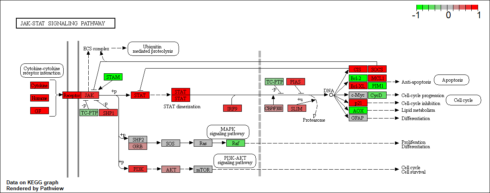
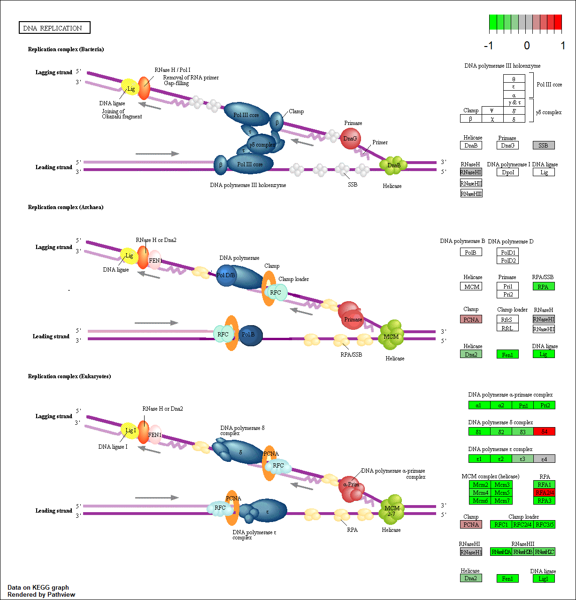

```{r setup, include=FALSE}
knitr::opts_chunk$set(echo = TRUE)
```

# Section 1.1 Differential Expression Analysis
The data for for hands-on session comes from GEO entry: GSE37704, which is associated with the following publication:

Trapnell C, Hendrickson DG, Sauvageau M, Goff L et al. "Differential analysis of gene regulation at transcript resolution with RNA-seq". Nat Biotechnol 2013 Jan;31(1):46-53. PMID: 23222703
```{r echo=T, results='hide'}
library(DESeq2)
metaFile <- "GSE37704_metadata.csv"
countFile <- "GSE37704_featurecounts.csv"

# Import metadata and take a peak
colData = read.csv(metaFile, row.names=1)
head(colData)
# Import countdata
countData = read.csv(countFile, row.names=1)
head(countData)
# we need to remove the first column of countData "length"
countData <- as.matrix(countData[,-1])
head(countData)

# Filter count data where you have 0 read count across all samples.
countData <- countData[rowSums(countData)!=0, ]
head(countData)
nrow(countData)

```

# Principal component analysis
```{r}

# try PCA to compare control vs. treated samples
pc <- prcomp(t(countData))
plot(pc) # scree plot
summary(pc)

# make pc plot
pc.col <- c(rep("blue",3),rep("red",3)) # define colors
plot(pc$x[,1:2],col=pc.col)
# Add a legend
legend(100, 95, legend=c("control", "hoxa1_kd"),
       col=c("blue", "red"), pch=1, cex=0.8)
```


# Section 1.2: Running DESeq2
```{r}
dds = DESeqDataSetFromMatrix(countData=countData,
                             colData=colData,
                             design=~condition)
dds = DESeq(dds)
# print DEseq data
dds
# get results for the HoxA1 knockdown versus control siRNA
res = results(dds)
summary(res)
```
# Section 1.3: Volcono plot
```{r}
plot( res$log2FoldChange, -log(res$padj) )

# Make a color vector for all genes
mycols <- rep("gray", nrow(res) )

# Color red the genes with absolute fold change above 2
mycols[ abs(res$log2FoldChange) > 2 ] <- "red"

# Color blue those with adjusted p-value less than 0.01
#  and absolute fold change more than 2
inds <- (res$padj < 0.01) & (abs(res$log2FoldChange) > 2 )
mycols[ inds ] <- "blue"

plot( res$log2FoldChange, -log(res$padj), col=mycols, xlab="Log2(FoldChange)", ylab="-Log(P-value)" )
```

# Section 1.4: Adding gene annotation
Use the mapIDs() function multiple times to add SYMBOL, ENTREZID and GENENAME annotation to our results to prepare for KEGG database annotation.
```{r}
library("AnnotationDbi")
library("org.Hs.eg.db")

columns(org.Hs.eg.db)

res$symbol = mapIds(org.Hs.eg.db,
                    keys=row.names(res), 
                    keytype="ENSEMBL",
                    column="SYMBOL",
                    multiVals="first")

res$entrez = mapIds(org.Hs.eg.db,
                    keys=row.names(res),
                    keytype="ENSEMBL",
                    column="ENTREZID",
                    multiVals="first")

res$name =   mapIds(org.Hs.eg.db,
                    keys=row.names(res),
                    keytype="ENSEMBL",
                    column="GENENAME",
                    multiVals="first")

head(res, 10)

# reorder these results by adjusted p-value and save them to a CSV file in the current project directory
res = res[order(res$pvalue),]
write.csv(res, "deseq_results.csv")
```

# Section 2: Pathway Analysis
Here we are going to use the gage package for pathway analysis. Once we have a list of enriched pathways, we're going to use the pathview package to draw pathway diagrams, shading the molecules in the pathway by their degree of up/down-regulation.

# Section 2.1: KEGG pathways
The gageData package has pre-compiled databases mapping genes to KEGG pathways and GO terms for common organisms. kegg.sets.hs is a named list of 229 elements. Each element is a character vector of member gene Entrez IDs for a single KEGG pathway. (See also go.sets.hs). The sigmet.idx.hs is an index of numbers of signaling and metabolic pathways in kegg.set.gs. In other words, KEGG pathway include other types of pathway definitions, like "Global Map" and "Human Diseases", which may be undesirable in a particular pathway analysis. Therefore, kegg.sets.hs[sigmet.idx.hs] gives you the "cleaner" gene sets of signaling and metabolic pathways only.

```{r}
library(pathview)
library(gage)
library(gageData)

data(kegg.sets.hs)
data(sigmet.idx.hs)

# Focus on signaling and metabolic pathways only
kegg.sets.hs = kegg.sets.hs[sigmet.idx.hs]

# Examine the first 3 pathways
head(kegg.sets.hs, 3)


```

The main gage() function requires a named vector of fold changes, where the names of the values are the Entrez gene IDs.

Note that we used the mapIDs() function above to obtain Entrez gene IDs (stored in res$entrez), and we have the fold change results from DESeq2 analysis (stored in res$log2FoldChange).

```{r}
# prepare data for gage() analysis
foldchanges = res$log2FoldChange
names(foldchanges) = res$entrez # colnames are entrez IDs
head(foldchanges)

# Get the gage() results
keggres = gage(foldchanges, gsets=kegg.sets.hs)
# check what the output is
attributes(keggres)
summary(keggres)

# Look at the first few down (less) pathways
head(keggres$less)
# look at first few up (greater) pathways
head(keggres$greater)

```

Now, let's try out the pathview() function from the pathview package to make a pathway plot with our RNA-Seq expression results shown in color.
To begin with lets manually supply a pathway.id (namely the first part of the "hsa04110 Cell cycle") that we could see from the print out above.

```{r eval=FALSE}
pathview(gene.data=foldchanges, pathway.id="hsa04110")
```

```{r eval=FALSE}
# A different PDF based output of the same data
pathview(gene.data=foldchanges, pathway.id="hsa04110", kegg.native=FALSE)

# Focus on top 5 upregulated pathways here for demo purposes only
keggrespathways <- rownames(keggres$greater)[1:5]

# Extract the 8 character long IDs part of each string
keggresids = substr(keggrespathways, start=1, stop=8)
keggresids

# pass these IDs in keggresids to the pathview() function to draw plots for all the top 5 pathways.

pathview(gene.data=foldchanges, pathway.id=keggresids, species="hsa")
```




```{r eval=FALSE}

# repeat for downregulated pathways
keggrespathways.down <- rownames(keggres$less)[1:5]
keggresids = substr(keggrespathways.down, start=1, stop=8)
keggresids
pathview(gene.data=foldchanges, pathway.id=keggresids, species="hsa")

```





# Section 3: Gene Ontology (GO)

We can also do a similar procedure with gene ontology. Similar to above, go.sets.hs has all GO terms. go.subs.hs is a named list containing indexes for the BP, CC, and MF ontologies. Let’s focus on BP (a.k.a Biological Process) here.
```{r}
data(go.sets.hs)
data(go.subs.hs)

# Focus on Biological Process subset of GO
gobpsets = go.sets.hs[go.subs.hs$BP]

gobpres = gage(foldchanges, gsets=gobpsets, same.dir=TRUE)

# check head for all components of gage results
lapply(gobpres, head)
```
# Section 4: Reactome Analysis
Reactome is database consisting of biological molecules and their relation to pathways and processes. Reactome, such as many other tools, has an online software available (https://reactome.org/) and R package available (https://bioconductor.org/packages/release/bioc/html/ReactomePA.html).

If you would like more information, the documentation is available here: https://reactome.org/user/guide

Let's now conduct over-representation enrichment analysis and pathway-topology analysis with Reactome using the previous list of significant genes generated from our differential expression results above.

First, Using R, output the list of significant genes at the 0.05 level as a plain text file:
```{r}
sig_genes <- res[res$padj <= 0.05 & !is.na(res$padj), "symbol"]
print(paste("Total number of significant genes:", length(sig_genes)))
# write the output
write.table(sig_genes, file="significant_genes.txt", row.names=FALSE, col.names=FALSE, quote=FALSE)

```
Then, to perform pathway analysis online go to the Reactome website (https://reactome.org/PathwayBrowser/#TOOL=AT). Select “choose file” to upload your significant gene list. Then, select the parameters “Project to Humans”, then click “Analyze”.

From the reactome analysis, it looks like cell cycle pathways (especially mitotic) and immune pathways (endosomal) have the most significant “Entities p-value”. This complements/overlaps with the results fropm the KEGG mapping, but is not exactly the same because the terminology and scope of the pathways (annotation) slightly differ.


# Section 5. GO online (OPTIONAL)
Gene Set Gene Ontology (GO) Enrichment is a method to determine over-represented or under-represented GO terms for a given set of genes. GO terms are formal structured controlled vocabularies (ontologies) for gene products in terms of their biological function. The goal of this analysis is to determine the biological process the given set of genes are associated with.

To perform Gene Set GO Enrichment online go to the website http://www.geneontology.org/page/go-enrichment-analysis. Paste your significant gene list from section 4. Then, select "biological process" and "homo sapiens", and click submit.

