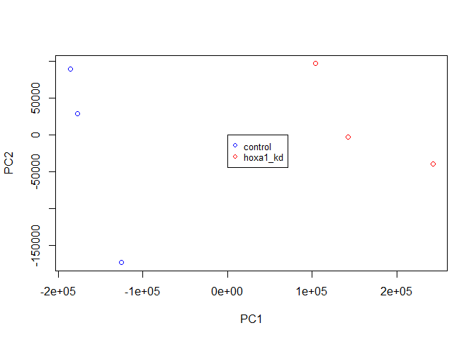

Class 15 - Gene finding and functional annotation
================
Livia Songster
11/15/2019

# Section 1.1 Differential Expression Analysis

The data for for hands-on session comes from GEO entry: GSE37704, which
is associated with the following publication:

Trapnell C, Hendrickson DG, Sauvageau M, Goff L et al. “Differential
analysis of gene regulation at transcript resolution with RNA-seq”. Nat
Biotechnol 2013 Jan;31(1):46-53. PMID: 23222703

``` r
library(DESeq2)
```

    ## Loading required package: S4Vectors

    ## Loading required package: stats4

    ## Loading required package: BiocGenerics

    ## Loading required package: parallel

    ## 
    ## Attaching package: 'BiocGenerics'

    ## The following objects are masked from 'package:parallel':
    ## 
    ##     clusterApply, clusterApplyLB, clusterCall, clusterEvalQ,
    ##     clusterExport, clusterMap, parApply, parCapply, parLapply,
    ##     parLapplyLB, parRapply, parSapply, parSapplyLB

    ## The following objects are masked from 'package:stats':
    ## 
    ##     IQR, mad, sd, var, xtabs

    ## The following objects are masked from 'package:base':
    ## 
    ##     anyDuplicated, append, as.data.frame, basename, cbind,
    ##     colMeans, colnames, colSums, dirname, do.call, duplicated,
    ##     eval, evalq, Filter, Find, get, grep, grepl, intersect,
    ##     is.unsorted, lapply, lengths, Map, mapply, match, mget, order,
    ##     paste, pmax, pmax.int, pmin, pmin.int, Position, rank, rbind,
    ##     Reduce, rowMeans, rownames, rowSums, sapply, setdiff, sort,
    ##     table, tapply, union, unique, unsplit, which, which.max,
    ##     which.min

    ## 
    ## Attaching package: 'S4Vectors'

    ## The following object is masked from 'package:base':
    ## 
    ##     expand.grid

    ## Loading required package: IRanges

    ## 
    ## Attaching package: 'IRanges'

    ## The following object is masked from 'package:grDevices':
    ## 
    ##     windows

    ## Loading required package: GenomicRanges

    ## Loading required package: GenomeInfoDb

    ## Loading required package: SummarizedExperiment

    ## Loading required package: Biobase

    ## Welcome to Bioconductor
    ## 
    ##     Vignettes contain introductory material; view with
    ##     'browseVignettes()'. To cite Bioconductor, see
    ##     'citation("Biobase")', and for packages 'citation("pkgname")'.

    ## Loading required package: DelayedArray

    ## Loading required package: matrixStats

    ## 
    ## Attaching package: 'matrixStats'

    ## The following objects are masked from 'package:Biobase':
    ## 
    ##     anyMissing, rowMedians

    ## Loading required package: BiocParallel

    ## 
    ## Attaching package: 'DelayedArray'

    ## The following objects are masked from 'package:matrixStats':
    ## 
    ##     colMaxs, colMins, colRanges, rowMaxs, rowMins, rowRanges

    ## The following objects are masked from 'package:base':
    ## 
    ##     aperm, apply

``` r
metaFile <- "GSE37704_metadata.csv"
countFile <- "GSE37704_featurecounts.csv"

# Import metadata and take a peak
colData = read.csv(metaFile, row.names=1)
head(colData)
# Import countdata
countData = read.csv(countFile, row.names=1)
head(countData)
# we need to remove the first column of countData "length"
countData <- as.matrix(countData[,-1])
head(countData)

# Filter count data where you have 0 read count across all samples.
countData <- countData[rowSums(countData)!=0, ]
head(countData)
nrow(countData)
```

# Principal component analysis

``` r
# try PCA to compare control vs. treated samples
pc <- prcomp(t(countData))
plot(pc) # scree plot
```

<!-- -->

``` r
summary(pc)
```

    ## Importance of components:
    ##                              PC1       PC2       PC3       PC4      PC5
    ## Standard deviation     1.852e+05 1.001e+05 1.998e+04 6.886e+03 5.15e+03
    ## Proportion of Variance 7.659e-01 2.235e-01 8.920e-03 1.060e-03 5.90e-04
    ## Cumulative Proportion  7.659e-01 9.894e-01 9.983e-01 9.994e-01 1.00e+00
    ##                              PC6
    ## Standard deviation     9.558e-10
    ## Proportion of Variance 0.000e+00
    ## Cumulative Proportion  1.000e+00

``` r
# make pc plot
pc.col <- c(rep("blue",3),rep("red",3)) # define colors
plot(pc$x[,1:2],col=pc.col)
# Add a legend
legend(100, 95, legend=c("control", "hoxa1_kd"),
       col=c("blue", "red"), pch=1, cex=0.8)
```

<!-- -->

# Section 1.2: Running DESeq2

``` r
dds = DESeqDataSetFromMatrix(countData=countData,
                             colData=colData,
                             design=~condition)
dds = DESeq(dds)
```

    ## estimating size factors

    ## estimating dispersions

    ## gene-wise dispersion estimates

    ## mean-dispersion relationship

    ## final dispersion estimates

    ## fitting model and testing

``` r
# print DEseq data
dds
```

    ## class: DESeqDataSet 
    ## dim: 15975 6 
    ## metadata(1): version
    ## assays(4): counts mu H cooks
    ## rownames(15975): ENSG00000279457 ENSG00000187634 ...
    ##   ENSG00000276345 ENSG00000271254
    ## rowData names(22): baseMean baseVar ... deviance maxCooks
    ## colnames(6): SRR493366 SRR493367 ... SRR493370 SRR493371
    ## colData names(2): condition sizeFactor

``` r
# get results for the HoxA1 knockdown versus control siRNA
res = results(dds)
summary(res)
```

    ## 
    ## out of 15975 with nonzero total read count
    ## adjusted p-value < 0.1
    ## LFC > 0 (up)       : 4349, 27%
    ## LFC < 0 (down)     : 4396, 28%
    ## outliers [1]       : 0, 0%
    ## low counts [2]     : 1237, 7.7%
    ## (mean count < 0)
    ## [1] see 'cooksCutoff' argument of ?results
    ## [2] see 'independentFiltering' argument of ?results

# Section 1.3: Volcono plot

``` r
plot( res$log2FoldChange, -log(res$padj) )
```

<!-- -->

``` r
# Make a color vector for all genes
mycols <- rep("gray", nrow(res) )

# Color red the genes with absolute fold change above 2
mycols[ abs(res$log2FoldChange) > 2 ] <- "red"

# Color blue those with adjusted p-value less than 0.01
#  and absolute fold change more than 2
inds <- (res$padj < 0.01) & (abs(res$log2FoldChange) > 2 )
mycols[ inds ] <- "blue"

plot( res$log2FoldChange, -log(res$padj), col=mycols, xlab="Log2(FoldChange)", ylab="-Log(P-value)" )
```

<!-- -->

# Section 1.4: Adding gene annotation

Use the mapIDs() function multiple times to add SYMBOL, ENTREZID and
GENENAME annotation to our results to prepare for KEGG database
annotation.

``` r
library("AnnotationDbi")
library("org.Hs.eg.db")
```

    ## 

``` r
columns(org.Hs.eg.db)
```

    ##  [1] "ACCNUM"       "ALIAS"        "ENSEMBL"      "ENSEMBLPROT" 
    ##  [5] "ENSEMBLTRANS" "ENTREZID"     "ENZYME"       "EVIDENCE"    
    ##  [9] "EVIDENCEALL"  "GENENAME"     "GO"           "GOALL"       
    ## [13] "IPI"          "MAP"          "OMIM"         "ONTOLOGY"    
    ## [17] "ONTOLOGYALL"  "PATH"         "PFAM"         "PMID"        
    ## [21] "PROSITE"      "REFSEQ"       "SYMBOL"       "UCSCKG"      
    ## [25] "UNIGENE"      "UNIPROT"

``` r
res$symbol = mapIds(org.Hs.eg.db,
                    keys=row.names(res), 
                    keytype="ENSEMBL",
                    column="SYMBOL",
                    multiVals="first")
```

    ## 'select()' returned 1:many mapping between keys and columns

``` r
res$entrez = mapIds(org.Hs.eg.db,
                    keys=row.names(res),
                    keytype="ENSEMBL",
                    column="ENTREZID",
                    multiVals="first")
```

    ## 'select()' returned 1:many mapping between keys and columns

``` r
res$name =   mapIds(org.Hs.eg.db,
                    keys=row.names(res),
                    keytype="ENSEMBL",
                    column="GENENAME",
                    multiVals="first")
```

    ## 'select()' returned 1:many mapping between keys and columns

``` r
head(res, 10)
```

    ## log2 fold change (MLE): condition hoxa1 kd vs control sirna 
    ## Wald test p-value: condition hoxa1 kd vs control sirna 
    ## DataFrame with 10 rows and 9 columns
    ##                          baseMean     log2FoldChange              lfcSE
    ##                         <numeric>          <numeric>          <numeric>
    ## ENSG00000279457  29.9135794276176  0.179257083672691  0.324821565250145
    ## ENSG00000187634  183.229649921658  0.426457118403306  0.140265820376892
    ## ENSG00000188976  1651.18807619944  -0.69272046484637 0.0548465415913946
    ## ENSG00000187961  209.637938486147  0.729755610585223  0.131859899969345
    ## ENSG00000187583  47.2551232589398 0.0405765278756304  0.271892808601774
    ## ENSG00000187642  11.9797501642461  0.542810491577363  0.521559849534146
    ## ENSG00000188290  108.922127976716    2.0570638345631  0.196905312993838
    ## ENSG00000187608   350.71686801731  0.257383686481774  0.102726560033541
    ## ENSG00000188157    9128.439421961  0.389908792022769 0.0467163395511376
    ## ENSG00000237330 0.158192358990472  0.785955208142751    4.0804728567969
    ##                              stat               pvalue
    ##                         <numeric>            <numeric>
    ## ENSG00000279457 0.551863246932652    0.581042050747029
    ## ENSG00000187634  3.04034951107421  0.00236303749730996
    ## ENSG00000188976 -12.6301576133482 1.43989540156439e-36
    ## ENSG00000187961  5.53432552849562 3.12428248077687e-08
    ## ENSG00000187583 0.149237223611385     0.88136644866915
    ## ENSG00000187642  1.04074439790984    0.297994191720983
    ## ENSG00000188290  10.4469696794188 1.51281875407603e-25
    ## ENSG00000187608   2.5055222952831    0.012227068940984
    ## ENSG00000188157   8.3463044358593 7.04321148758697e-17
    ## ENSG00000237330 0.192613757210411    0.847261469988086
    ##                                 padj      symbol      entrez
    ##                            <numeric> <character> <character>
    ## ENSG00000279457    0.686554777832897      WASH9P   102723897
    ## ENSG00000187634   0.0051571814949436      SAMD11      148398
    ## ENSG00000188976 1.76548905393145e-35       NOC2L       26155
    ## ENSG00000187961  1.1341299310761e-07      KLHL17      339451
    ## ENSG00000187583    0.919030615571383     PLEKHN1       84069
    ## ENSG00000187642    0.403379309754061       PERM1       84808
    ## ENSG00000188290 1.30538189681338e-24        HES4       57801
    ## ENSG00000187608   0.0237452288907922       ISG15        9636
    ## ENSG00000188157 4.21962808553076e-16        AGRN      375790
    ## ENSG00000237330                   NA      RNF223      401934
    ##                                                                     name
    ##                                                              <character>
    ## ENSG00000279457                 WAS protein family homolog 9, pseudogene
    ## ENSG00000187634                 sterile alpha motif domain containing 11
    ## ENSG00000188976 NOC2 like nucleolar associated transcriptional repressor
    ## ENSG00000187961                              kelch like family member 17
    ## ENSG00000187583                 pleckstrin homology domain containing N1
    ## ENSG00000187642             PPARGC1 and ESRR induced regulator, muscle 1
    ## ENSG00000188290                   hes family bHLH transcription factor 4
    ## ENSG00000187608                            ISG15 ubiquitin-like modifier
    ## ENSG00000188157                                                    agrin
    ## ENSG00000237330                                  ring finger protein 223

``` r
# reorder these results by adjusted p-value and save them to a CSV file in the current project directory
res = res[order(res$pvalue),]
write.csv(res, "deseq_results.csv")
```

# Section 2: Pathway Analysis

Here we are going to use the gage package for pathway analysis. Once we
have a list of enriched pathways, we’re going to use the pathview
package to draw pathway diagrams, shading the molecules in the pathway
by their degree of up/down-regulation.

# Section 2.1: KEGG pathways

The gageData package has pre-compiled databases mapping genes to KEGG
pathways and GO terms for common organisms. kegg.sets.hs is a named list
of 229 elements. Each element is a character vector of member gene
Entrez IDs for a single KEGG pathway. (See also go.sets.hs). The
sigmet.idx.hs is an index of numbers of signaling and metabolic pathways
in kegg.set.gs. In other words, KEGG pathway include other types of
pathway definitions, like “Global Map” and “Human Diseases”, which may
be undesirable in a particular pathway analysis. Therefore,
kegg.sets.hs\[sigmet.idx.hs\] gives you the “cleaner” gene sets of
signaling and metabolic pathways only.

``` r
library(pathview)
```

    ## ##############################################################################
    ## Pathview is an open source software package distributed under GNU General
    ## Public License version 3 (GPLv3). Details of GPLv3 is available at
    ## http://www.gnu.org/licenses/gpl-3.0.html. Particullary, users are required to
    ## formally cite the original Pathview paper (not just mention it) in publications
    ## or products. For details, do citation("pathview") within R.
    ## 
    ## The pathview downloads and uses KEGG data. Non-academic uses may require a KEGG
    ## license agreement (details at http://www.kegg.jp/kegg/legal.html).
    ## ##############################################################################

``` r
library(gage)
library(gageData)

data(kegg.sets.hs)
data(sigmet.idx.hs)

# Focus on signaling and metabolic pathways only
kegg.sets.hs = kegg.sets.hs[sigmet.idx.hs]

# Examine the first 3 pathways
head(kegg.sets.hs, 3)
```

    ## $`hsa00232 Caffeine metabolism`
    ## [1] "10"   "1544" "1548" "1549" "1553" "7498" "9"   
    ## 
    ## $`hsa00983 Drug metabolism - other enzymes`
    ##  [1] "10"     "1066"   "10720"  "10941"  "151531" "1548"   "1549"  
    ##  [8] "1551"   "1553"   "1576"   "1577"   "1806"   "1807"   "1890"  
    ## [15] "221223" "2990"   "3251"   "3614"   "3615"   "3704"   "51733" 
    ## [22] "54490"  "54575"  "54576"  "54577"  "54578"  "54579"  "54600" 
    ## [29] "54657"  "54658"  "54659"  "54963"  "574537" "64816"  "7083"  
    ## [36] "7084"   "7172"   "7363"   "7364"   "7365"   "7366"   "7367"  
    ## [43] "7371"   "7372"   "7378"   "7498"   "79799"  "83549"  "8824"  
    ## [50] "8833"   "9"      "978"   
    ## 
    ## $`hsa00230 Purine metabolism`
    ##   [1] "100"    "10201"  "10606"  "10621"  "10622"  "10623"  "107"   
    ##   [8] "10714"  "108"    "10846"  "109"    "111"    "11128"  "11164" 
    ##  [15] "112"    "113"    "114"    "115"    "122481" "122622" "124583"
    ##  [22] "132"    "158"    "159"    "1633"   "171568" "1716"   "196883"
    ##  [29] "203"    "204"    "205"    "221823" "2272"   "22978"  "23649" 
    ##  [36] "246721" "25885"  "2618"   "26289"  "270"    "271"    "27115" 
    ##  [43] "272"    "2766"   "2977"   "2982"   "2983"   "2984"   "2986"  
    ##  [50] "2987"   "29922"  "3000"   "30833"  "30834"  "318"    "3251"  
    ##  [57] "353"    "3614"   "3615"   "3704"   "377841" "471"    "4830"  
    ##  [64] "4831"   "4832"   "4833"   "4860"   "4881"   "4882"   "4907"  
    ##  [71] "50484"  "50940"  "51082"  "51251"  "51292"  "5136"   "5137"  
    ##  [78] "5138"   "5139"   "5140"   "5141"   "5142"   "5143"   "5144"  
    ##  [85] "5145"   "5146"   "5147"   "5148"   "5149"   "5150"   "5151"  
    ##  [92] "5152"   "5153"   "5158"   "5167"   "5169"   "51728"  "5198"  
    ##  [99] "5236"   "5313"   "5315"   "53343"  "54107"  "5422"   "5424"  
    ## [106] "5425"   "5426"   "5427"   "5430"   "5431"   "5432"   "5433"  
    ## [113] "5434"   "5435"   "5436"   "5437"   "5438"   "5439"   "5440"  
    ## [120] "5441"   "5471"   "548644" "55276"  "5557"   "5558"   "55703" 
    ## [127] "55811"  "55821"  "5631"   "5634"   "56655"  "56953"  "56985" 
    ## [134] "57804"  "58497"  "6240"   "6241"   "64425"  "646625" "654364"
    ## [141] "661"    "7498"   "8382"   "84172"  "84265"  "84284"  "84618" 
    ## [148] "8622"   "8654"   "87178"  "8833"   "9060"   "9061"   "93034" 
    ## [155] "953"    "9533"   "954"    "955"    "956"    "957"    "9583"  
    ## [162] "9615"

The main gage() function requires a named vector of fold changes, where
the names of the values are the Entrez gene IDs.

Note that we used the mapIDs() function above to obtain Entrez gene IDs
(stored in
res\(entrez), and we have the fold change results from DESeq2 analysis (stored in res\)log2FoldChange).

``` r
# prepare data for gage() analysis
foldchanges = res$log2FoldChange
names(foldchanges) = res$entrez # colnames are entrez IDs
head(foldchanges)
```

    ##      1266     54855      1465     51232      2034      2317 
    ## -2.422719  3.201955 -2.313738 -2.059631 -1.888019 -1.649792

``` r
# Get the gage() results
keggres = gage(foldchanges, gsets=kegg.sets.hs)
# check what the output is
attributes(keggres)
```

    ## $names
    ## [1] "greater" "less"    "stats"

``` r
summary(keggres)
```

    ##         Length Class  Mode   
    ## greater 1062   -none- numeric
    ## less    1062   -none- numeric
    ## stats    354   -none- numeric

``` r
# Look at the first few down (less) pathways
head(keggres$less)
```

    ##                                          p.geomean stat.mean        p.val
    ## hsa04110 Cell cycle                   8.995727e-06 -4.378644 8.995727e-06
    ## hsa03030 DNA replication              9.424076e-05 -3.951803 9.424076e-05
    ## hsa03013 RNA transport                1.129129e-03 -3.090204 1.129129e-03
    ## hsa03440 Homologous recombination     3.066756e-03 -2.852899 3.066756e-03
    ## hsa04114 Oocyte meiosis               3.784520e-03 -2.698128 3.784520e-03
    ## hsa00010 Glycolysis / Gluconeogenesis 8.961413e-03 -2.405398 8.961413e-03
    ##                                             q.val set.size         exp1
    ## hsa04110 Cell cycle                   0.001448312      121 8.995727e-06
    ## hsa03030 DNA replication              0.007586381       36 9.424076e-05
    ## hsa03013 RNA transport                0.060596596      144 1.129129e-03
    ## hsa03440 Homologous recombination     0.121861535       28 3.066756e-03
    ## hsa04114 Oocyte meiosis               0.121861535      102 3.784520e-03
    ## hsa00010 Glycolysis / Gluconeogenesis 0.212222694       53 8.961413e-03

``` r
# look at first few up (greater) pathways
head(keggres$greater)
```

    ##                                         p.geomean stat.mean       p.val
    ## hsa04640 Hematopoietic cell lineage   0.002822776  2.833362 0.002822776
    ## hsa04630 Jak-STAT signaling pathway   0.005202070  2.585673 0.005202070
    ## hsa00140 Steroid hormone biosynthesis 0.007255099  2.526744 0.007255099
    ## hsa04142 Lysosome                     0.010107392  2.338364 0.010107392
    ## hsa04330 Notch signaling pathway      0.018747253  2.111725 0.018747253
    ## hsa04916 Melanogenesis                0.019399766  2.081927 0.019399766
    ##                                           q.val set.size        exp1
    ## hsa04640 Hematopoietic cell lineage   0.3893570       55 0.002822776
    ## hsa04630 Jak-STAT signaling pathway   0.3893570      109 0.005202070
    ## hsa00140 Steroid hormone biosynthesis 0.3893570       31 0.007255099
    ## hsa04142 Lysosome                     0.4068225      118 0.010107392
    ## hsa04330 Notch signaling pathway      0.4391731       46 0.018747253
    ## hsa04916 Melanogenesis                0.4391731       90 0.019399766

Now, let’s try out the pathview() function from the pathview package to
make a pathway plot with our RNA-Seq expression results shown in color.
To begin with lets manually supply a pathway.id (namely the first part
of the “hsa04110 Cell cycle”) that we could see from the print out
above.

``` r
pathview(gene.data=foldchanges, pathway.id="hsa04110")
```


``` r
# A different PDF based output of the same data
pathview(gene.data=foldchanges, pathway.id="hsa04110", kegg.native=FALSE)

# Focus on top 5 upregulated pathways here for demo purposes only
keggrespathways <- rownames(keggres$greater)[1:5]

# Extract the 8 character long IDs part of each string
keggresids = substr(keggrespathways, start=1, stop=8)
keggresids

# pass these IDs in keggresids to the pathview() function to draw plots for all the top 5 pathways.

pathview(gene.data=foldchanges, pathway.id=keggresids, species="hsa")
```


 
 

``` r
# repeat for downregulated pathways
keggrespathways.down <- rownames(keggres$less)[1:5]
keggresids = substr(keggrespathways.down, start=1, stop=8)
keggresids
pathview(gene.data=foldchanges, pathway.id=keggresids, species="hsa")
```


# Section 3: Gene Ontology (GO)

We can also do a similar procedure with gene ontology. Similar to above,
go.sets.hs has all GO terms. go.subs.hs is a named list containing
indexes for the BP, CC, and MF ontologies. Let’s focus on BP (a.k.a
Biological Process) here.

``` r
data(go.sets.hs)
data(go.subs.hs)

# Focus on Biological Process subset of GO
gobpsets = go.sets.hs[go.subs.hs$BP]

gobpres = gage(foldchanges, gsets=gobpsets, same.dir=TRUE)

# check head for all components of gage results
lapply(gobpres, head)
```

    ## $greater
    ##                                              p.geomean stat.mean
    ## GO:0007156 homophilic cell adhesion       8.519724e-05  3.824205
    ## GO:0002009 morphogenesis of an epithelium 1.396681e-04  3.653886
    ## GO:0048729 tissue morphogenesis           1.432451e-04  3.643242
    ## GO:0007610 behavior                       2.195494e-04  3.530241
    ## GO:0060562 epithelial tube morphogenesis  5.932837e-04  3.261376
    ## GO:0035295 tube development               5.953254e-04  3.253665
    ##                                                  p.val     q.val set.size
    ## GO:0007156 homophilic cell adhesion       8.519724e-05 0.1951953      113
    ## GO:0002009 morphogenesis of an epithelium 1.396681e-04 0.1951953      339
    ## GO:0048729 tissue morphogenesis           1.432451e-04 0.1951953      424
    ## GO:0007610 behavior                       2.195494e-04 0.2243795      427
    ## GO:0060562 epithelial tube morphogenesis  5.932837e-04 0.3711390      257
    ## GO:0035295 tube development               5.953254e-04 0.3711390      391
    ##                                                   exp1
    ## GO:0007156 homophilic cell adhesion       8.519724e-05
    ## GO:0002009 morphogenesis of an epithelium 1.396681e-04
    ## GO:0048729 tissue morphogenesis           1.432451e-04
    ## GO:0007610 behavior                       2.195494e-04
    ## GO:0060562 epithelial tube morphogenesis  5.932837e-04
    ## GO:0035295 tube development               5.953254e-04
    ## 
    ## $less
    ##                                             p.geomean stat.mean
    ## GO:0048285 organelle fission             1.661796e-15 -8.053464
    ## GO:0000280 nuclear division              4.640583e-15 -7.928483
    ## GO:0007067 mitosis                       4.640583e-15 -7.928483
    ## GO:0000087 M phase of mitotic cell cycle 1.262556e-14 -7.787048
    ## GO:0007059 chromosome segregation        2.028624e-11 -6.878340
    ## GO:0000236 mitotic prometaphase          2.025795e-10 -6.666757
    ##                                                 p.val        q.val
    ## GO:0048285 organelle fission             1.661796e-15 6.323567e-12
    ## GO:0000280 nuclear division              4.640583e-15 6.323567e-12
    ## GO:0007067 mitosis                       4.640583e-15 6.323567e-12
    ## GO:0000087 M phase of mitotic cell cycle 1.262556e-14 1.290333e-11
    ## GO:0007059 chromosome segregation        2.028624e-11 1.658603e-08
    ## GO:0000236 mitotic prometaphase          2.025795e-10 1.271109e-07
    ##                                          set.size         exp1
    ## GO:0048285 organelle fission                  376 1.661796e-15
    ## GO:0000280 nuclear division                   352 4.640583e-15
    ## GO:0007067 mitosis                            352 4.640583e-15
    ## GO:0000087 M phase of mitotic cell cycle      362 1.262556e-14
    ## GO:0007059 chromosome segregation             142 2.028624e-11
    ## GO:0000236 mitotic prometaphase                84 2.025795e-10
    ## 
    ## $stats
    ##                                           stat.mean     exp1
    ## GO:0007156 homophilic cell adhesion        3.824205 3.824205
    ## GO:0002009 morphogenesis of an epithelium  3.653886 3.653886
    ## GO:0048729 tissue morphogenesis            3.643242 3.643242
    ## GO:0007610 behavior                        3.530241 3.530241
    ## GO:0060562 epithelial tube morphogenesis   3.261376 3.261376
    ## GO:0035295 tube development                3.253665 3.253665

# Section 4: Reactome Analysis

Reactome is database consisting of biological molecules and their
relation to pathways and processes. Reactome, such as many other tools,
has an online software available (<https://reactome.org/>) and R package
available
(<https://bioconductor.org/packages/release/bioc/html/ReactomePA.html>).

If you would like more information, the documentation is available here:
<https://reactome.org/user/guide>

Let’s now conduct over-representation enrichment analysis and
pathway-topology analysis with Reactome using the previous list of
significant genes generated from our differential expression results
above.

First, Using R, output the list of significant genes at the 0.05 level
as a plain text file:

``` r
sig_genes <- res[res$padj <= 0.05 & !is.na(res$padj), "symbol"]
print(paste("Total number of significant genes:", length(sig_genes)))
```

    ## [1] "Total number of significant genes: 8147"

``` r
# write the output
write.table(sig_genes, file="significant_genes.txt", row.names=FALSE, col.names=FALSE, quote=FALSE)
```

Then, to perform pathway analysis online go to the Reactome website
(<https://reactome.org/PathwayBrowser/#TOOL=AT>). Select “choose file”
to upload your significant gene list. Then, select the parameters
“Project to Humans”, then click “Analyze”.

From the reactome analysis, it looks like cell cycle pathways
(especially mitotic) and immune pathways (endosomal) have the most
significant “Entities p-value”. This complements/overlaps with the
results fropm the KEGG mapping, but is not exactly the same because the
terminology and scope of the pathways (annotation) slightly differ.

# Section 5. GO online (OPTIONAL)

Gene Set Gene Ontology (GO) Enrichment is a method to determine
over-represented or under-represented GO terms for a given set of genes.
GO terms are formal structured controlled vocabularies (ontologies) for
gene products in terms of their biological function. The goal of this
analysis is to determine the biological process the given set of genes
are associated with.

To perform Gene Set GO Enrichment online go to the website
<http://www.geneontology.org/page/go-enrichment-analysis>. Paste your
significant gene list from section 4. Then, select “biological process”
and “homo sapiens”, and click submit.
