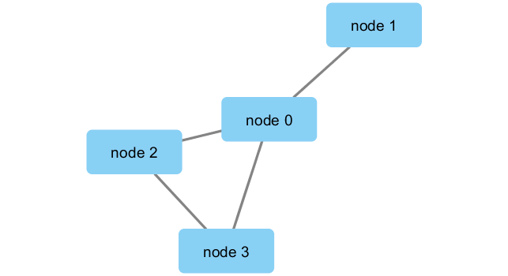

```{r setup, include=FALSE}
knitr::opts_chunk$set(echo = TRUE)
```

#Metagenomics co-occurence networks: Connect with Cytoscape
```{r}
library(RCy3)
library(igraph)
library(RColorBrewer)

# Test the connection to Cytoscape.
cytoscapePing()
# Check the version
cytoscapeVersionInfo()
# make a simple graph
g <- makeSimpleIgraph()
createNetworkFromIgraph(g,"myGraph")
# render the graph from Cytoscape into rmarkdown
fig <- exportImage(filename="demo", type="png", height=350)


# make it pretty
setVisualStyle("Marquee")
fig <- exportImage(filename="demo_marquee", type="png", height=350)
knitr::include_graphics("./demo_marquee.png")
# check out other styles we can use
styles <- getVisualStyleNames()
styles
# we can also just plot the data in r base:
plot(g)
```

# Read in the metagenomics data
We will read in a species co-occurrence matrix that was calculated using Spearman Rank coefficient. (see reference Lima-Mendez et al. (2015) for details).
```{r}
# scripts for processing located in "inst/data-raw/"
prok_vir_cor <- read.delim("virus_prok_cor_abundant.tsv", stringsAsFactors = FALSE)

# Have a peak at the first 6 rows
head(prok_vir_cor)

```

We will use the igraph package to convert the co-occurrence dataframe into a network that we can send to Cytoscape. In this case our graph is undirected (so we will set directed = FALSE) since we do not have any information about the direction of the interactions from this type of data.
```{r}
g <- graph.data.frame(prok_vir_cor, directed = FALSE)
class(g)
g
plot(g)
# make the graph neater
plot(g, vertex.label=NA)
plot(g, vertex.size=3, vertex.label=NA)

```

# Using ggplot for network analysis
```{r}
library(ggraph)
ggraph(g, layout = 'auto') +
  geom_edge_link(alpha = 0.25) +
  geom_node_point(color="steelblue") +
  theme_graph()
# Send this network to Cytoscape
createNetworkFromIgraph(g,"myIgraph")
```
# Network querys on vertex and nodes
```{r}
# for vertices
V(g)
# for edges
E(g)
```

# Network community detection by Girvan & Newman clustering
```{r}
cb <- cluster_edge_betweenness(g)
cb
plot(cb, y=g, vertex.label=NA,  vertex.size=3)
head( membership(cb) )

```

