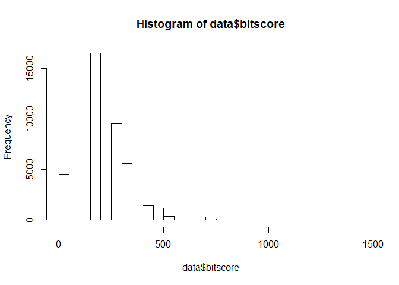
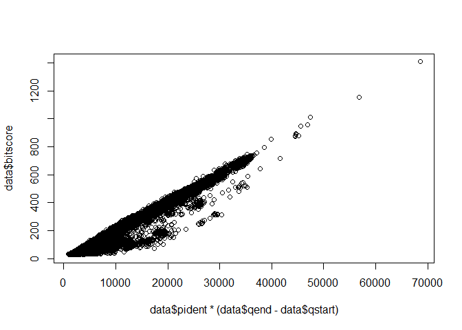
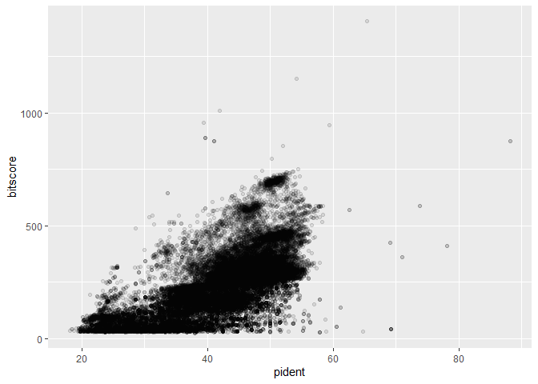
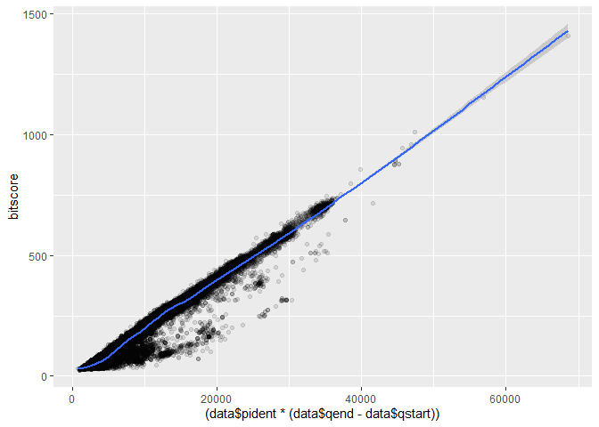

class 17
================

# Read in data

``` r
data <- read.delim("mm-second.x.zebrafish.tsv",sep="\t",header=FALSE)
names(data)<-c("qseqid", "sseqid", "pident", "length", "mismatch", "gapopen", "qstart", "qend", "sstart", "send", "evalue", "bitscore")
hist(data$bitscore,breaks=30)
```

<!-- -->

Is there a relationship between percent identity and bitscore for our
alignments?

``` r
# using base r
plot(data$pident  * (data$qend - data$qstart), data$bitscore)
# using ggplot
library(ggplot2)
```

<!-- -->

``` r
ggplot(data, aes(pident, bitscore)) + geom_point(alpha=0.1) 
```

<!-- -->

``` r
# add a trendline
ggplot(data, aes((data$pident * (data$qend - data$qstart)), bitscore)) + geom_point(alpha=0.1) + geom_smooth()
```

    ## `geom_smooth()` using method = 'gam' and formula 'y ~ s(x, bs = "cs")'

<!-- -->
